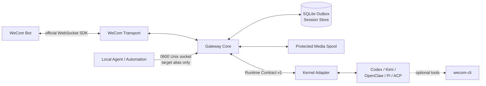

# wecom-agent-gateway

> A WeCom Bot IM gateway for pluggable Agent kernels.

[](https://github.com/fyaic/wecom-agent-gateway/actions/workflows/ci.yml)
[](LICENSE)
[](package.json)
[](ROADMAP.md)

[简体中文](README.md) · English


wecom-agent-gateway connects to WeCom through the official
[`@wecom/aibot-node-sdk`](https://github.com/WecomTeam/aibot-node-sdk), maps
messages and mutable streaming replies to a stable Runtime Contract, and hands
them to Codex, Kimi Code, OpenClaw, Pi Agent, or another Agent kernel.

Its job is the faithful IM path: transport, normalization, sessions, media,
mutable presentation, access control, and reliable delivery. Agent reasoning,
model selection, tool policy, and media understanding stay in the Kernel.

> [!IMPORTANT]
> This is an independent community project, not an official Tencent WeCom
> product. OpenClaw-only deployments should also evaluate the official
> [`wecom-openclaw-plugin`](https://github.com/WecomTeam/wecom-openclaw-plugin).
> This project focuses on multiple kernels, a stable Runtime Contract, and an
> independently reliable transport layer.

## Highlights

- **Official SDK first** — WeCom authentication, heartbeat, reconnect, media
  download/decryption, and proactive push use the official SDK.
- **Kernel-neutral Core** — no Codex, Kimi, OpenClaw, Pi, or model-vendor types
  leak into Gateway Core.
- **Mutable Bot UX** — one reply evolves from an immediate acknowledgement to
  explicit Agent status, streamed text, and the final answer.
- **Structured cards** — neutral notices, articles, actions, choices, and forms
  map to official template cards; approval callbacks are durable and update in
  place.
- **Interaction broker** — card choices bypass text interpretation; the Gateway
  persists, validates, updates, and resumes the same Agent session; Pi native
  ask-user is bridged end to end.
- **Final reply actions** — a streamed answer can carry native quick actions;
  scoped, idempotent callbacks continue the same Agent session while write
  tools still require approval.
- **Durable delivery** — SQLite outbox leases, retries, dead letters, and a
  protected media spool survive process failure.
- **Exact modalities** — transports and adapters declare concrete media types
  and fail closed instead of fabricating placeholder prompts.
- **Secure defaults** — one Bot identity, scoped allowlists, redacted logs,
  ephemeral inbound media, bounded output roots, and write-tool approvals.
- **Bidirectional IM** — local Agents can proactively send to authorized aliases
  through a `0600` socket without Bot secrets or internal conversation IDs.
- **Operable by default** — loopback liveness/readiness, privacy-safe Prometheus
  metrics, systemd, and a non-root container baseline.

## Architecture



- The Transport owns the official WeCom Bot protocol and media transfer.
- Core owns ordering, deduplication, sessions, capability checks, streaming
  projection, and durable delivery.
- An Adapter only translates one Kernel's SDK/RPC, sessions, and events.
- The Kernel owns models, reasoning, tools, workspace, and transcripts.
- `wecom-cli` is an optional office-tool layer, never a human-identity fallback.
- The local control plane reuses the same Bot, durable outbox, and official SDK.

## Kernel adapters

| Adapter     | Upstream interface           | Validated capabilities                                                                       |
| ----------- | ---------------------------- | -------------------------------------------------------------------------------------------- |
| Codex       | SDK / App Server JSONL       | Streaming, resume, cancel, status, approvals, tools, image/audio                             |
| Kimi Code   | ACP v1 stdio                 | Streaming, resume, cancel, permissions, status, image                                        |
| Generic ACP | ACP v1 stdio                 | Resume and media negotiated through `initialize`                                             |
| OpenClaw    | Gateway WebSocket v4         | Streaming, resume, cancel, status, image/audio/video/file                                    |
| Pi Agent    | Official strict-LF JSONL RPC | Streaming, resume, cancel, status, dynamic image input, bounded worker pool, native ask-user |

One Gateway process hosts one explicitly selected Kernel. See the
[adapter authoring guide](docs/adapter-authoring.md) and the runnable
[Adapter template](examples/adapter-template) to add another Kernel through
`@fyaic/wecom-adapter-sdk` and `GATEWAY_ADAPTER=external`, without changing the
Gateway registry.

See the [interaction-card architecture](docs/interaction-cards.md) for the
implemented durable callback, TTL, scoped interaction, and Agent-resume design.
The side-effect-free [Pi interaction extension](examples/pi-wecom-interaction.mjs)
demonstrates native select, confirm, and text input.

## Quick start

Requirements: Node.js 22+, pnpm 11.8.0, a WeCom intelligent Bot configured for
long-connection/API mode, and one independently working Agent kernel.

```bash
git clone https://github.com/fyaic/wecom-agent-gateway.git
cd wecom-agent-gateway
pnpm install --frozen-lockfile
pnpm run ci

cp .env.example .env
chmod 600 .env
```

Configure at least the Bot and selected adapter:

```dotenv
WECOM_BOT_ID=
WECOM_BOT_SECRET=
GATEWAY_ADAPTER=openclaw
OPENCLAW_GATEWAY_URL=ws://127.0.0.1:18789
```

Resolve scoped allowlists using readable local names. Internal IDs are not
printed:

```bash
pnpm configure:allowlist --direct 'Authorized test member' --group 'Authorized test group'
pnpm enroll:direct --name 'Authorized test member'
pnpm doctor
pnpm start:checked
```

The default test suite uses deterministic fakes and needs no real WeCom or model
credentials. See the [real WeCom runbook](docs/real-wecom-runbook.md) for each
Kernel's setup and operator-triggered smoke tests.
See the [production deployment baseline](docs/deployment.md) for systemd,
containers, and health semantics.

To enable proactive Agent messages, set `GATEWAY_CONTROL_ENABLED=true`. A single
scoped direct and group target automatically receives the aliases `direct` and
`group`:

```bash
pnpm proactive:health
pnpm proactive:send --target direct --text 'The build has completed.'
pnpm proactive:send --target group --file /allowed/report.pdf --media-type file
```

The client never loads `.env`. Additional aliases must map to targets already in
the matching scoped allowlist, and media still obeys `WECOM_MEDIA_OUTPUT_ROOTS`.

## Reliability and security semantics

- Turns are ordered per conversation and concurrent across conversations.
- Delivery is **at-least-once**, not exactly-once.
- Expired passive streaming windows can fall back to official proactive push.
- Inbound media is ephemeral and removed after the run.
- Outbound media is copied into a Gateway-owned spool and verified by size and
  hash.
- Only regular files below `WECOM_MEDIA_OUTPUT_ROOTS` may be sent.
- Write tools require durable approval bound to sender, conversation, and run.
- Adapter child processes do not inherit Bot secrets or the full host
  environment by default.

Read the [architecture](docs/architecture.md), [security policy](SECURITY.md),
and [ADRs](docs/README.md) for the complete contract.

## Maturity

The project is in **Public Preview**; a stable v1 API is not promised yet. The
current baseline has 155 deterministic tests and real acceptance evidence for
direct and group conversations, mutable streaming, session recovery,
image/file/MP4 transfer, proactive media, managed restarts, and four Kernel
families. Cross-process SQLite outbox lease recovery after `SIGKILL` and a
managed macOS Gateway crash/re-authentication are also covered. Isolated Linux
network detach/recovery, a read-only persistent volume, and capacity exhaustion
on a bounded tmpfs have real fault evidence. Host-level NIC loss, a native
WeCom `msgtype=video` callback, and multi-instance ordering remain on the
roadmap.

- [Current status and evidence](docs/status.md)
- [Roadmap](ROADMAP.md)
- [Changelog](CHANGELOG.md)

## Contributing and license

Read [CONTRIBUTING.md](CONTRIBUTING.md), the
[Code of Conduct](CODE_OF_CONDUCT.md), and [SUPPORT.md](SUPPORT.md) before
participating. Security reports belong in a private GitHub Security Advisory.

Original project code is licensed under the [MIT License](LICENSE). Dependency
and upstream provenance is documented in
[THIRD_PARTY_NOTICES.md](THIRD_PARTY_NOTICES.md) and
[docs/licensing.md](docs/licensing.md).

WeCom, Tencent, Codex, Kimi, OpenClaw, Pi, and other names and marks belong to
their respective owners.
