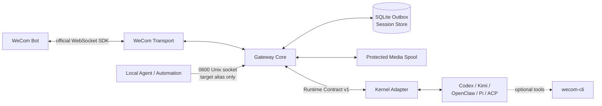

<p align="center">
  
</p>

<p align="center">
  <a href="https://github.com/fyaic/wecom-agent-gateway/actions/workflows/ci.yml"></a>
  <a href="LICENSE"></a>
  <a href="package.json"></a>
  <a href="ROADMAP.md"></a>
</p>

<p align="center">
  <a href="#26-second-demo"><strong>26-second demo</strong></a> ·
  <a href="#quick-start"><strong>Quick start</strong></a> ·
  <a href="docs/verified-kernel-cases.en.md">Real cases</a> ·
  <a href="#reference-agent-adapters"><strong>Agent Adapters</strong></a> ·
  <a href="docs/README.md">Documentation</a> ·
  <a href="README.md">简体中文</a>
</p>

# WeCom Agent Gateway

Turn one WeCom Bot into a reliable IM front door for Codex, Kimi Code,
OpenClaw, Pi Agent, and other Agent kernels.

**WeCom provides reach. The Agent provides intelligence. The Gateway makes the
path between them reliable.**

People send text and media through an ordinary WeCom conversation. The Gateway
receives the callbacks the client actually produces through the official SDK,
owns session and streaming behavior, and hands a stable Runtime Contract to the
selected Agent according to declared Adapter capabilities. The Agent can use
the same controlled path to push messages and media or ask for native
confirmation, selection, and cancellation.

> [!IMPORTANT]
> This is an independent community project, not an official Tencent WeCom
> product. OpenClaw-only deployments should also evaluate the official
> [`wecom-openclaw-plugin`](https://github.com/WecomTeam/wecom-openclaw-plugin).
> This project is for multiple kernels, a stable Runtime Contract, and an
> independently reliable IM layer.

## Current evidence boundary

This repository is a **Public Preview**, not a claim that every feature is
end-to-end complete or production-certified. Status deliberately separates
implementation, deterministic automation, and evidence from a real WeCom
client:

| Capability                        | Current evidence                                                                                                    |
| --------------------------------- | ------------------------------------------------------------------------------------------------------------------- |
| Direct/group text and streaming   | **Real path passed** with authorized clients, a real Bot, and multiple Kernels                                      |
| Images, generic files, media push | **Partly real-path tested**; each input/output direction still depends on the selected Adapter                      |
| Video                             | **Partial**: protocol fixtures and lifecycle automation pass; desktop MP4 semantic classification/rejection is real |
| Native `msgtype=video` callback   | **Pending**: no real client callback captured; the current Pi Adapter cannot understand video                       |
| Quoted/replied callback           | **Real-path acceptance pending**; Contract, media lifecycle, and Adapter mapping are deterministic                  |
| Production operation              | **Not production-certified**; host NIC loss, 24-hour Linux soak, and cross-host multi-instance remain pending       |

See the authoritative [status](docs/status.md), [roadmap](ROADMAP.md), and
[evidence-claim policy](docs/evidence-claims.md). Every support claim must say
whether it means implementation, deterministic evidence, or real end-to-end
evidence.

## Why it exists

Making an Agent answer one WeCom message is easy. Keeping that integration
reliable is not. Rebuilding Bot authentication, heartbeat and reconnect, group
scope, media decryption, sessions, mutable streaming, retries, and security for
every Kernel produces a collection of incompatible channel plugins.

WeCom Agent Gateway implements the WeCom side once. A new Agent only needs a
small Adapter. Changing Kernel does not rebuild the IM path, and improving
delivery or interaction does not invade the Agent reasoning loop.

## What one message does

```text
WeCom user ⇄ official Bot WebSocket ⇄ Gateway ⇄ Kernel Adapter ⇄ Agent
 text / image / file / video       session / ACL / stream / outbox    model / tools
```

1. The Gateway applies the scoped allowlist and acknowledges receipt quickly.
2. Neutral text and media parts reach the Agent in strict conversation order.
3. Explicit Agent status and text deltas update one Bot message in place; the
   final answer goes through the durable outbox.
4. Native ask-user or cancel events can become WeCom cards whose result resumes
   the original session.
5. The Agent can proactively send text or media to authorized direct and group
   targets through the same path.

## 26-second demo

<p align="center">
  <a href="docs/assets/demo/wecom-agent-gateway-demo.mp4">
    
  </a>
</p>

<p align="center"><em>A real macOS WeCom client and a real Pi Agent: immediate status, final reply, native confirmation, same-task resume, and proactive text/media. Select the animation for the HD MP4.</em></p>

This is the production Gateway, official Bot SDK, and scoped proactive control
path—not a UI mock. Public assets retain only the conversation pane and remove
the sidebar, account name, internal IDs, and credentials. Ordinary replies do
not attach cards by default.

## Quick start

### Validate the repository without a Bot or model credential

```bash
git clone https://github.com/fyaic/wecom-agent-gateway.git
cd wecom-agent-gateway
pnpm install --frozen-lockfile
pnpm run ci
```

More than 230 deterministic tests traverse the Runtime Contract, Gateway Core,
official SDK mapping, sessions, streaming, media, outbox, Interaction Broker,
and every reference Adapter. They spend no model quota and contact no real Bot.

### Connect one real WeCom Bot and Agent

Prepare Node.js 22, pnpm 11.8.0, a WeCom intelligent Bot with
long-connection/API mode enabled, and one Agent Kernel that already works on
its own. Create a local-only configuration:

```bash
cp .env.example .env
chmod 600 .env
```

This minimal example selects a local OpenClaw Gateway. Any supported Adapter
below can be selected instead.

```dotenv
WECOM_BOT_ID=
WECOM_BOT_SECRET=
GATEWAY_ADAPTER=openclaw
OPENCLAW_GATEWAY_URL=ws://127.0.0.1:18789
```

Enroll one authorized direct conversation without copying or exposing any
internal ID:

```bash
pnpm enroll:direct --name 'Authorized test member'
```

The command displays a one-time token. Send it in that member's direct Bot
conversation, then check and start the deployment:

```bash
pnpm doctor
pnpm start:checked
```

An empty allowlist fails closed. `.env`, SQLite, logs, and media stay outside
Git. Continue with the [15-minute guide](docs/getting-started.en.md). The
[real WeCom runbook](docs/real-wecom-runbook.md) records group authorization,
complete acceptance, and smoke commands; the
[deployment baseline](docs/deployment.md) covers production operation.

## What you get

| Capability                      | Gateway semantics                                                                                                                       |
| ------------------------------- | --------------------------------------------------------------------------------------------------------------------------------------- |
| Official WeCom path             | Official SDK authentication, heartbeat, reconnect, media download/decryption, streaming replies, and proactive push                     |
| Kernel-neutral integration      | Codex, ACP/Kimi, OpenClaw, Pi, and external Adapters share one Runtime Contract; Core has no model-vendor types                         |
| Conversation and media fidelity | Received direct/group messages, quoted context, text, and media use capability negotiation; unaccepted paths fail closed                |
| Native Bot UX                   | Immediate acknowledgement, in-place streaming, explicit status/emoji, and optional confirmation, selection, approval, and cancel cards  |
| Reliable bidirectional delivery | SQLite outbox, retry, dead letters, crash recovery, protected media spool, and authorized proactive Agent messages                      |
| Security and operation          | Scoped ACLs, least-environment child processes, write approvals, privacy-safe logs, health, Prometheus, and systemd/container baselines |

## Reference Agent Adapters

| Adapter     | Upstream interface           | Implemented or negotiated capabilities                                                                   |
| ----------- | ---------------------------- | -------------------------------------------------------------------------------------------------------- |
| Codex       | SDK / App Server JSONL       | Streaming, resume, reply actions, native ask-user, cancel, status, approvals, dynamic tools, image/audio |
| Kimi Code   | ACP v1 stdio                 | Streaming, resume, reply actions, cancel, permissions, status, image                                     |
| Generic ACP | ACP v1 stdio                 | Resume, reply actions, and input modalities negotiated through `initialize`                              |
| OpenClaw    | Gateway WebSocket v4         | Streaming, resume, reply actions, cancel, status, image/audio/video/file                                 |
| Pi Agent    | Official strict-LF JSONL RPC | Streaming, resume, reply actions, cancel, status, dynamic image input, bounded workers, native ask-user  |

This table describes Adapter implementation/protocol scope; it **does not mean
that every capability has passed a real WeCom end-to-end test**. Use the
[real-case matrix](docs/verified-kernel-cases.en.md) and
[status](docs/status.md) for evidence levels and open items. In particular,
native video callbacks and video understanding by the current Pi Adapter remain
unfinished.

One Gateway process hosts one explicitly selected Kernel. Add another Kernel
with the [Adapter authoring guide](docs/adapter-authoring.md),
`@fyaic/wecom-adapter-sdk`, and the runnable
[Adapter template](examples/adapter-template), without modifying the Gateway
registry. The [clean-room Adapter](examples/clean-room-adapter) depends only on
the public SDK and has a reproducible
[machine-readable report](docs/evidence/adapter-conformance-clean-room.json).
Run `pnpm conformance:adapter --module <adapter>` without connecting WeCom.
Claude Code also has an [isolated C0 experimental package](packages/adapter-claude-code)
using the official Agent SDK. It currently proves only deterministic text,
streaming, session, and cancellation protocol behavior; it is not registered by
the default Gateway and is not part of the real validation matrix below.
The Channel side has the same versioned extension boundary. The vendor-free
[`transport-loopback`](packages/transport-loopback) passes a fixed
[22-check machine report](docs/evidence/transport-conformance-loopback.json).
A new IM can implement Transport v1, but vendor authentication, callbacks, and
client visibility still require separate evidence; acceptance is not “seen.”

The [verified case portfolio](docs/verified-kernel-cases.en.md) separates real
WeCom evidence from deterministic and local protocol tests. The
[interaction design](docs/interaction-cards.md) documents durable callbacks,
TTL, scoped results, and Agent resume.

## How it fits

| Option                         | Best fit                                                               | Relationship to this project                                                                                       |
| ------------------------------ | ---------------------------------------------------------------------- | ------------------------------------------------------------------------------------------------------------------ |
| Official WeCom OpenClaw plugin | The fastest official path when OpenClaw is the only Kernel             | Evaluate it first; this project targets multiple Kernels and an independent reliability layer                      |
| `wecom-cli` / `wecom-unified`  | Agent access to contacts, calendar, todos, docs, and other office APIs | Optional tool layer, not the persistent IM session transport                                                       |
| Custom webhook Bot             | Fixed commands, notifications, or lightweight business automation      | Appropriate for simple flows; this project adds sessions, mutable streaming, media, Adapters, and durable delivery |
| **WeCom Agent Gateway**        | One WeCom channel for different Agent Kernels                          | Unifies Channel behavior while leaving model, reasoning, and tools inside each Agent                               |

This project is not another Agent framework and does not replace Codex,
OpenClaw, Pi, Kimi, or a model. It is the IM infrastructure layer between
WeCom and those systems.

## Architecture and boundary



- The Transport owns the official WeCom Bot protocol and media transfer.
- Core owns ordering, deduplication, sessions, capabilities, projection, and
  durable delivery.
- An Adapter only translates one Kernel's SDK/RPC, sessions, and events.
- The Kernel owns models, reasoning, tools, workspace, and transcripts.
- `wecom-cli` is an optional office-tool layer, never a human-identity fallback.
- Proactive local control reuses the same Bot, outbox, and official SDK.

> [!NOTE]
> The mainline is IM connectivity, normalized message fidelity, sessions,
> media, reliable delivery, and a stable Adapter Contract. Cards are an
> optional Transport projection: ordinary replies do not attach them by
> default, and cards never redefine Agent reasoning semantics.

## Proactive Agent messages

Set `GATEWAY_CONTROL_ENABLED=true`. A single scoped direct and group target
automatically receives the aliases `direct` and `group`:

```bash
pnpm proactive:health
pnpm proactive:send --target direct --text 'The build has completed.'
pnpm proactive:send --target group --file /allowed/report.pdf --media-type file
```

The client never loads `.env`. Additional aliases must already belong to the
matching scoped allowlist, and media still obeys `WECOM_MEDIA_OUTPUT_ROOTS`.

## Reliability and security semantics

- Turns are ordered per conversation and concurrent across conversations.
- A second local Gateway for the same Bot fails before the official SDK is
  connected; cross-host active-active remains unsupported.
- Delivery is **at-least-once**, not exactly-once.
- Expired passive streams can fall back to official proactive push.
- Inbound media is ephemeral; outbound media is copied into a verified,
  Gateway-owned spool.
- Only regular files below `WECOM_MEDIA_OUTPUT_ROOTS` may be sent.
- Write tools require durable approval bound to sender, conversation, and run.
- Adapter children inherit a minimal environment; Bot secrets are never
  forwarded.
- Feedback and welcome events use the same ACL without creating Agent turns.
- Raw SDK messages and Adapter stderr are disabled in logs by default.
- SQLite schema compatibility fails closed; bounded retention preserves
  pending, leased, and dead work.
- Transient reconnect is unbounded by default, authentication failure remains
  bounded, and private endpoints require credential-free `wss://`.

Read the [architecture](docs/architecture.md), [security policy](SECURITY.md),
and [ADRs](docs/README.md) for the full contract.

## Project status

The project is in **Public Preview**; a stable v1 API is not promised. The
current baseline has more than 230 deterministic tests and real acceptance evidence for
direct/group conversations, mutable streaming, session recovery,
image/file/MP4 transfer, proactive media, managed restarts, and four Kernel
families. Cross-process SQLite outbox recovery, isolated Linux network
detach/recovery, read-only storage, bounded-capacity exhaustion, and managed
macOS re-authentication also have evidence.

Host-level NIC loss, a native WeCom `msgtype=video` callback, and
cross-host multi-instance fencing/order remain on the roadmap.

| If you want to…                | Start here                                                |
| ------------------------------ | --------------------------------------------------------- |
| See real Agent integrations    | [Verified Kernel cases](docs/verified-kernel-cases.en.md) |
| Connect a real Bot             | [15-minute integration guide](docs/getting-started.en.md) |
| Run the full acceptance matrix | [Real WeCom runbook](docs/real-wecom-runbook.md)          |
| Add another Agent              | [Adapter authoring guide](docs/adapter-authoring.md)      |
| Add another IM Channel         | [Transport authoring guide](docs/transport-authoring.md)  |
| Understand cards and callbacks | [Interaction design](docs/interaction-cards.md)           |
| Operate the Gateway            | [Deployment baseline](docs/deployment.md)                 |
| Audit current claims and gaps  | [Status](docs/status.md) and [roadmap](ROADMAP.md)        |

## Contributing and license

Read [CONTRIBUTING.md](CONTRIBUTING.md), the
[Code of Conduct](CODE_OF_CONDUCT.md), and [SUPPORT.md](SUPPORT.md) before
participating. Security reports belong in a private GitHub Security Advisory.

Original project code is licensed under the [MIT License](LICENSE). Dependency
and upstream provenance is documented in
[THIRD_PARTY_NOTICES.md](THIRD_PARTY_NOTICES.md) and
[docs/licensing.md](docs/licensing.md).

WeCom, Tencent, Codex, Kimi, OpenClaw, Pi, and other names and marks belong to
their respective owners.
