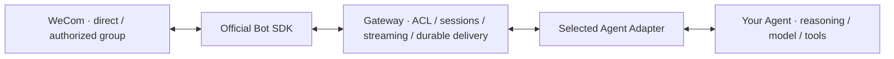

# WeCom Agent Gateway

**Use your existing Agent from WeCom. Ask questions, send screenshots, and get results away from your desk.**

Connect Codex, Kimi Code, OpenClaw, or Pi to one WeCom Bot. Continue a Gateway conversation in a direct chat,
@mention the Bot in an authorized group, and watch answers stream. Change Agents without rebuilding the WeCom connection.

[](https://github.com/fyaic/wecom-agent-gateway/actions/workflows/ci.yml)
[](LICENSE)
[](ROADMAP.md)

[Quick start](#quick-start) · [Choose an Agent](#reference-agent-adapters) · [Everyday uses](docs/use-cases.en.md) · [Docs](docs/README.md) · [中文](README.md)

## See it in 26 seconds

[](docs/assets/demo/wecom-agent-gateway-demo.mp4)

_Real WeCom + Pi Agent; click for the MP4. Ordinary replies do not append cards by default. The confirmation shown is explicitly requested._

| Everyday friction                                 | With the Gateway                                                    |
| ------------------------------------------------- | ------------------------------------------------------------------- |
| Return to a terminal whenever you need your Agent | Ask from WeCom and continue the same Gateway conversation           |
| Screenshot on your phone; Agent on your computer  | Send it to a Bot backed by an image-capable Agent                   |
| Keep checking whether a build or report finished  | Have your local job send you a notification                         |
| Rewrite a WeCom plugin whenever you change Agents | Switch the Adapter; reuse transport, sessions, and durable delivery |

> **Public Preview.** Codex, Kimi, OpenClaw, and Pi have [real WeCom integration records](docs/verified-kernel-cases.en.md).
> One selected Agent per Gateway process. Bring a configured Agent and an API-mode WeCom Bot.
> Media, cards, and tools vary by Adapter; see the [evidence boundary](#current-evidence-boundary).
> This is an independent community project.

## Quick start

Requires **Node.js 22.13+ and pnpm 11.8.0**. The source-based deployment path targets macOS / Linux.
There is no published one-command npm installer or hosted Agent service.

### 1. See the plumbing work — no credentials

```bash
git clone https://github.com/fyaic/wecom-agent-gateway.git
cd wecom-agent-gateway
pnpm install --frozen-lockfile
pnpm demo
```

Six checks exercise the real Core, SQLite store, and external Adapter loader:
reply delivery, deduplication, access control, session recovery, proactive delivery, and drained outbox.
This is deterministic **Echo**, not AI and not a real WeCom callback.

### 2. Choose an Agent you already use

```bash
# Choose one: codex | kimi | pi | openclaw
pnpm onboard --adapter pi
# To let a local CLI Agent work in an existing project instead:
# pnpm onboard --adapter pi --workspace /path/to/project
```

Creates a minimal private `.env`, never overwriting an existing file. Fill `WECOM_BOT_ID` and
`WECOM_BOT_SECRET` from your API-mode, long-connection Bot. OpenClaw also requires its
local Gateway token or password. Other Agents must already be installed and authenticated.

The default local CLI workspace is an ignored `agent-workspace/` directory.
See [per-Agent prerequisites](docs/getting-started.en.md#2-choose-an-existing-agent) before starting.
Optional: `pnpm agent:check` checks two real model turns and session continuity without connecting a Bot; it uses your Agent account/quota.

### 3. Authorize your direct chat and start

```bash
pnpm enroll:direct
# Send the displayed one-time code to your Bot in a direct chat.
pnpm start:checked
```

Keep other instances using this Bot stopped during enrollment. Send:
“Remember the project name Bamboo; reply briefly.” Then: “What project name did I just tell you?”

Expect a mutable reply and the same conversation context on the second turn.
Ordinary replies have **no automatic follow-up card** in the starter configuration.

No working Agent yet? Use `pnpm onboard --adapter echo` for the same real-Bot setup with an explicitly non-AI echo response.
If `.env` already exists, edit it to switch profiles; the generator refuses to overwrite it.

[Full setup and troubleshooting](docs/getting-started.en.md) · [Examples](examples/README.md)

## Reference Agent Adapters

| Agent / harness  | Connection                                        | What “ready” means                                                                            |
| ---------------- | ------------------------------------------------- | --------------------------------------------------------------------------------------------- |
| Codex            | Official App Server; SDK path also available      | Logged-in CLI; starter uses read-only workspace access                                        |
| Kimi Code        | ACP v1                                            | Working `kimi acp` and local authentication                                                   |
| Pi               | Official JSONL RPC                                | Working Pi provider/model configuration                                                       |
| OpenClaw         | Local Gateway WebSocket                           | Running Gateway, token/password, configured Agent                                             |
| Other ACP Agents | Configurable ACP v1 executable                    | Configure executable/arguments and validate its negotiated capabilities                       |
| Other harnesses  | [External Adapter SDK](docs/adapter-authoring.md) | Implement the contract; no Core or Registry fork required                                     |
| Claude Code      | Experimental official Agent SDK package           | Not registered as a default starter; successful authenticated real validation remains pending |

**This does not take over an existing terminal or desktop task.** The Gateway manages its own Agent sessions.
Switching kernels does not migrate their history. “Kernel-neutral” means a shared integration contract,
not zero configuration or identical media/tool support for every Agent.

## What would I use it for?

- **Check code away from your desk:** point a local CLI Agent at a repository, then ask “Where is the login redirect decided? Explain without changing files.”
- **Troubleshoot a screenshot:** send an error image to a vision-capable Agent and ask for next checks.
- **Stop polling a job:** after a local build succeeds, invoke:
  ```bash
  pnpm proactive:send --target direct --text 'Build finished. Ready for review.'
  ```
  Run this from the Gateway directory while its service is running. The starter enables the private local control socket.
  The `direct` alias requires exactly one authorized sender.
- **Answer an Agent’s question from your phone:** supported native ask-user hooks become scoped confirmation/choice cards, then resume the same task.

These are [practical recipes with prerequisites](docs/use-cases.en.md), not a promise of built-in scheduling,
unrestricted office access, or video understanding. Existing real evidence is collected [separately](docs/verified-kernel-cases.en.md).

## Where it fits



The Gateway transports information and explicit Agent events; it does not decide how an Agent thinks.
The [official WeCom SDK](https://github.com/WecomTeam/aibot-node-sdk) handles Bot connectivity.
[wecom-cli](https://github.com/WecomTeam/wecom-cli) is an optional office-tool layer, not the inbound IM transport.
If you only need OpenClaw, also consider the [official WeCom OpenClaw plugin](https://github.com/WecomTeam/wecom-openclaw-plugin).

## Current evidence boundary

| Capability                                                          | Evidence                                                                                                 |
| ------------------------------------------------------------------- | -------------------------------------------------------------------------------------------------------- |
| Text, streaming, continuity, image/file paths, proactive delivery   | Real cases plus deterministic regressions; exact scope varies by Adapter                                 |
| Choice/confirmation, resume, cancellation                           | Real scoped cases plus regressions; opt-in and capability-dependent                                      |
| Native `msgtype=video` callback                                     | Deterministic coverage; **real native callback still pending**. MP4 received as `file` is not equivalent |
| Inbound quoted-message callback                                     | Implemented/tested; real client callback certification still pending                                     |
| Physical host outage, Linux 24-hour soak, multi-instance production | Not certified; tooling or design is not production evidence                                              |

Transporting video does not give an Agent video-understanding tools.
See [evidence rules](docs/evidence-claims.md), [status](docs/status.md), and [deployment limits](docs/deployment.md).

## Repository and community

| Directory                    | Purpose                                                  |
| ---------------------------- | -------------------------------------------------------- |
| `apps/gateway/`              | Configured service entry point and diagnostics           |
| `packages/runtime-contract/` | Vendor-neutral Agent and Transport contracts             |
| `packages/channel-core/`     | Routing, sessions, streaming, and delivery orchestration |
| `packages/adapter-*/`        | Agent-specific protocol adapters                         |
| `examples/`                  | Echo/template, SDK-only Adapter, interaction example     |
| `docs/`                      | Setup, cases, architecture, evidence, and operations     |
| `scripts/` / `deploy/`       | Demo, onboarding, verification, deployment examples      |

[Report onboarding friction](https://github.com/fyaic/wecom-agent-gateway/issues/new?template=onboarding.yml) ·
[Report a bug](https://github.com/fyaic/wecom-agent-gateway/issues/new?template=bug_report.yml) ·
[Contribute an Adapter](CONTRIBUTING.md) · [Roadmap](ROADMAP.md) · [Changelog](CHANGELOG.md)

[MIT License](LICENSE). See [third-party notices](THIRD_PARTY_NOTICES.md) for upstream references and dependencies.
Product names and trademarks belong to their respective owners.
