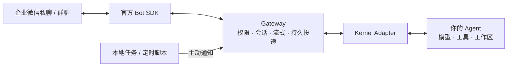

# WeCom Agent Gateway

**在企业微信里用你已经在用的 Agent。离开电脑，也能继续问、发图、看结果。**

把 Codex、Kimi Code、OpenClaw 或 Pi 接到一个企业微信机器人：私聊继续任务，群里 @Bot 提问，
长回复边生成边显示。更换 Agent 时复用同一条企微链路。

[](https://github.com/fyaic/wecom-agent-gateway/actions/workflows/ci.yml)
[](LICENSE)
[](ROADMAP.md)

[快速开始](#快速开始) · [选你的 Agent](#参考-agent-adapter) · [日常怎么用](docs/use-cases.md) · [文档](docs/README.md) · [English](README.en.md)

## 26 秒看懂

[](docs/assets/demo/wecom-agent-gateway-demo.mp4)

_真实企业微信 + Pi Agent，点击查看高清 MP4。普通聊天默认不附卡片；演示中的确认由显式交互触发。_

| 日常困扰                            | 接入后                                    |
| ----------------------------------- | ----------------------------------------- |
| 每次问 Agent 都要回到电脑、打开终端 | 在企业微信私聊里提问，继续同一会话        |
| 截图在手机上，Agent 在电脑上        | 把图片发给 Bot，交给支持图片的 Agent      |
| 跑完构建或报告后，还要反复查看进度  | 让本地任务经 Gateway 主动通知你           |
| 换 Agent 就要再写一遍企微插件       | 换 Adapter 配置，复用收发、会话与投递能力 |

> **Public Preview。** Codex、Kimi、OpenClaw、Pi 有[真实企微接入记录](docs/verified-kernel-cases.md)。
> 每个进程选择一个 Agent；需要已配置好的 Agent 和企业微信 Bot。媒体、卡片和工具能力因 Adapter 而异，
> 详见[当前证据边界](#当前证据边界)。本项目是独立社区项目。

## 快速开始

需要 **Node.js 22.13+、pnpm 11.8.0**；当前部署路径面向 macOS / Linux。仓库从源码安装，
尚未提供发布到 npm 的一键安装包。先用你已经能独立回答的 Agent，模型和登录继续由它管理。

### 1. 下载，立即看一次本地效果

```bash
git clone https://github.com/fyaic/wecom-agent-gateway.git
cd wecom-agent-gateway
pnpm install --frozen-lockfile
pnpm demo
```

终端会展示收消息、回复、去重、权限拒绝、重建 Gateway 后会话引用恢复和主动通知，最后输出
`6/6 checks passed`。它运行真实 Core、SQLite 和外部 Adapter 加载器，使用本地 Echo；
**不调用 AI、不连接企微、不读取你的 .env**。真实客户端效果见上面的演示。

### 2. 选一个已有 Agent，生成最小配置

```bash
# 换成 codex / kimi / pi / openclaw；仅在首次安装运行。
pnpm onboard --adapter pi
```

命令创建私有 `.env` 和独立的 `agent-workspace/`，已有配置会保留。想问已有代码库的问题，
加 `--workspace /path/to/project`。打开 `.env` 填入 API/长连接 Bot 的
`WECOM_BOT_ID`、`WECOM_BOT_SECRET`；OpenClaw 还需要已有 Gateway 的 token 或 password。
[各 Agent 配置与登录说明](docs/getting-started.md#2-选择已有-agent)。

### 3. 认领私聊，开始聊天

```bash
pnpm enroll:direct
# 在你与 Bot 的私聊中发终端显示的一次性口令，等待注册完成。
pnpm start:checked
```

在企微里发「只回复：连接成功」，然后试「记住这次测试代号是青竹」和「刚才的代号是什么？」。
预期先收到回执，再在同一条气泡中看到回答。持续使用时，让 Gateway 和 Agent 所在电脑保持在线，
并按[部署指南](docs/deployment.md)安装受管服务。

想在连接 Bot **之前**验证 Agent 登录、模型回答和上下文续接：

```bash
pnpm agent:check
```

这会使用配置的 Agent 额度执行两个真实模型回合，不连接 Bot。Agent 尚未配置好时，可先用
`pnpm onboard --adapter echo` 验证真实企微收发；Echo 是回显探针，不具有 AI 能力。
完整步骤、预期结果和常见卡点见[接入指南](docs/getting-started.md)。

## 参考 Agent Adapter

| 你已在用         | 选择                       | 接入前需要                                             | 真实证据                               |
| ---------------- | -------------------------- | ------------------------------------------------------ | -------------------------------------- |
| Codex            | `--adapter codex`          | 本地 CLI 已登录；默认只读工作区                        | 私聊/群聊、图片、恢复、审批            |
| Kimi Code        | `--adapter kimi`           | `kimi acp` 可启动且已登录                              | 私聊、图片、恢复                       |
| Pi Agent         | `--adapter pi`             | 已配置 provider/model；图片需视觉模型                  | 私聊/群聊、图片、原生交互、恢复        |
| OpenClaw         | `--adapter openclaw`       | 本地 Gateway 已启动，提供 token/password               | 私聊/群聊、图片/文件、恢复             |
| 其他 ACP harness | `GATEWAY_ADAPTER=acp`      | ACP v1 命令及协商能力                                  | Kimi 是已验证代表；其他逐个验收        |
| 自研 Agent       | `GATEWAY_ADAPTER=external` | 公共 SDK 的小型 Adapter                                | [模板及一致性检查](examples/README.md) |
| Claude Code      | 实验包                     | [隔离测试说明](docs/claude-code-adapter-evaluation.md) | 尚未接入默认启动入口                   |

**连接会创建/恢复 Gateway 管理的 Agent 会话，不会自动接管终端或桌面 App 里已打开的任务。**
更换 Kernel 不会自动迁移聊天记忆。新 harness 需要已有 ACP 接口或编写 Adapter；
通用扩展契约并不意味着任意 Agent 名称都能即插即用。

## 日常怎么用

- **通勤时查看代码解释**：「看下这个项目登录流程，列出三个可能失败的位置。」先把工作目录指向代码库；
  默认 Codex 只读配置适合阅读和排查。
- **手机截图问问题**：「这张报错截图是什么意思？下一步检查什么？」需要图片 Adapter 和视觉模型。
- **任务完成提醒**：在本机任务成功后的脚本里执行下方通知命令，不用一直守着终端。
- **Agent 向你确认**：支持的原生提问事件可变成确认/选择卡片；单靠一句“给我按钮”不能保证产生卡片。

```bash
# onboard 已启用本地控制面；Gateway 保持运行，在第二个终端执行。
pnpm proactive:send --target direct --text '报告生成完了，可以查看。'
```

定时调度、构建、查文档仍由 Agent 或脚本完成。更多具体对话、条件和边界见[日常使用配方](docs/use-cases.md)。
`direct` 别名要求恰好一个授权成员；多人部署需配置明确的目标别名。

## 项目在链路中的位置



Gateway 负责收发、顺序、去重和失败恢复；Adapter 翻译 Agent 协议；Agent 决定模型、推理与工具。
鉴权、心跳、重连和媒体加解密复用[官方 SDK](https://github.com/WecomTeam/aibot-node-sdk)。
官方 `wecom-cli` 是可选办公工具层，无需安装它即可完成首次私聊。

只需要 OpenClaw 的用户也可以选择[企业微信官方 OpenClaw 插件](https://github.com/WecomTeam/wecom-openclaw-plugin)。
本项目适合需要多种 Agent 接入选择、独立部署与可扩展 Adapter 的用户。所有收发使用单一 Bot 身份。

## 当前证据边界

| 能力                          | 当前状态                                                                      |
| ----------------------------- | ----------------------------------------------------------------------------- |
| 私聊/群聊文本、流式、多轮会话 | 多个 Kernel 真实通过；不是全模型、全版本认证                                  |
| 图片、普通文件、主动媒体      | 按 Adapter/方向有真实记录；模型理解另行验证                                   |
| 原生 `msgtype=video` callback | 未完成真实验收；桌面 MP4 的 `file` 回调不能替代                               |
| 入站引用/回复 callback        | 自动化覆盖；当前 macOS 客户端未取得真实回调                                   |
| 原生交互与取消                | 按 Adapter 声明提供；普通消息默认不附快捷卡                                   |
| 生产运行                      | 单机故障基线已验证；24h Linux soak、宿主物理断网与跨主机 active-active 未认证 |

一个 Bot 只运行一个 Gateway；投递语义是 at-least-once。主动消息限于已授权会话，
不等于可以向任意外部联系人发消息。授权和工具权限由部署者控制。
[完整状态](docs/status.md) · [真实测试案例](docs/verified-kernel-cases.md) · [证据规范](docs/evidence-claims.md)

## 仓库导航与社区

| 目录                              | 用途                                                     |
| --------------------------------- | -------------------------------------------------------- |
| `apps/gateway/`                   | 启动入口、Adapter 注册、配置检查                         |
| `packages/`                       | Core、Runtime Contract、Adapter、Transport、存储和控制面 |
| [`examples/`](examples/README.md) | 外部 Adapter 模板与 Pi 原生交互示例                      |
| [`docs/`](docs/README.md)         | 上手、使用配方、接入证据、架构与运维                     |
| `scripts/` / `deploy/`            | 演示、配置生成、验收命令与部署样例                       |

[报告上手卡点](https://github.com/fyaic/wecom-agent-gateway/issues/new?template=onboarding.yml) ·
[报告 Bug](https://github.com/fyaic/wecom-agent-gateway/issues/new?template=bug_report.yml) ·
[贡献 Adapter](CONTRIBUTING.md) · [路线图](ROADMAP.md) · [变更记录](CHANGELOG.md)

使用 [MIT License](LICENSE)。官方项目参考与第三方依赖见 [THIRD_PARTY_NOTICES.md](THIRD_PARTY_NOTICES.md)。
企业微信及各 Agent 名称、商标归相应权利人所有。
