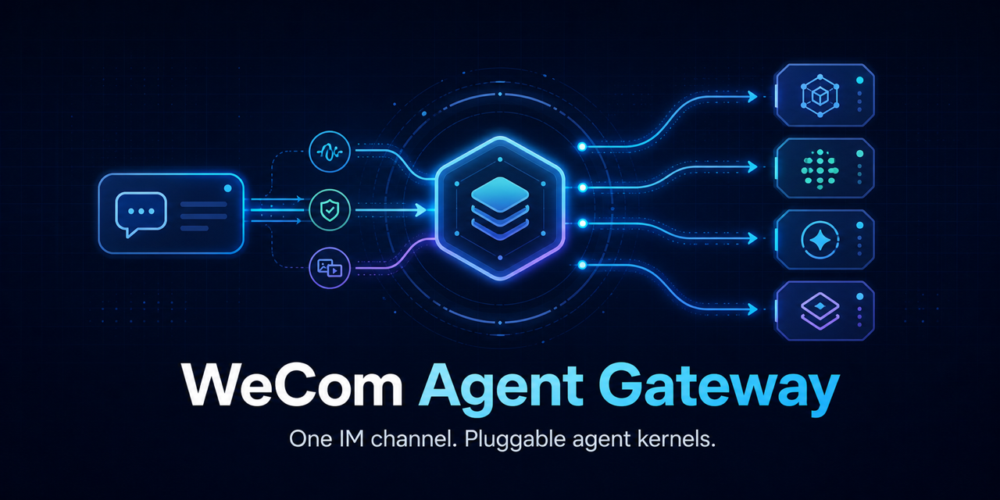
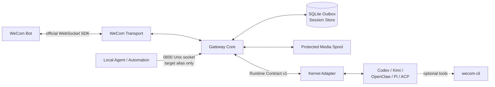

# wecom-agent-gateway

> 面向多种 Agent Kernel 的企业微信 Bot IM Gateway。

[](https://github.com/fyaic/wecom-agent-gateway/actions/workflows/ci.yml)
[](LICENSE)
[](package.json)
[](ROADMAP.md)

简体中文 · [English](README.en.md)



wecom-agent-gateway 使用企业微信官方
[`@wecom/aibot-node-sdk`](https://github.com/WecomTeam/aibot-node-sdk)
连接 Bot WebSocket，把文本、图片、文件、视频和可变流式回复转换为稳定的 Runtime Contract，再交给
Codex、Kimi Code、OpenClaw、Pi Agent 或其他 Agent Kernel。

它只负责忠实、稳定的 IM 链路：接入、归一化、会话、媒体、流式呈现、访问控制和可靠投递。
Agent 如何思考、选择模型、调用工具或理解视频，不属于 Gateway Core。

> [!IMPORTANT]
> 本项目是独立社区项目，不是腾讯企业微信官方产品。只需要 OpenClaw 的用户应同时评估企业微信官方
> [`wecom-openclaw-plugin`](https://github.com/WecomTeam/wecom-openclaw-plugin)；本项目的重点是
> 多 Kernel、稳定 Runtime Contract 和独立可靠传输层。

## 为什么需要它

- **官方 SDK 优先**：认证、心跳、重连、媒体下载/解密和主动推送由企业微信官方 SDK 实现。
- **Kernel 中立**：Core 不依赖 Codex、Kimi、OpenClaw、Pi 或任何模型厂商类型。
- **可变消息 UX**：同一条 Bot 消息可从即时回执更新为 Agent 显式状态、流式增量和最终正文。
- **结构化卡片**：通用通知、图文、按钮、投票和表单映射官方模板卡片；审批按钮回调持久且可原位更新。
- **可靠投递**：文本与媒体发送前进入 SQLite outbox；租约、重试、死信和媒体 spool 支持崩溃恢复。
- **精确多模态**：Transport 与 Adapter 声明具体输入/输出类型，不支持时 fail closed，不伪造文字占位。
- **安全默认值**：单一 Bot 身份、分域白名单、敏感字段脱敏、受保护临时媒体和写工具审批。
- **双向 IM**：Agent 可通过 `0600` 本地 socket 按授权别名主动发送，不接触 Bot Secret 或内部会话 ID。
- **可运维**：loopback liveness/readiness、无用户数据 Prometheus 指标、systemd 与非 root 容器基线。

## 架构



边界很明确：

- WeCom Transport 负责官方 Bot 协议和媒体传输；
- Gateway Core 负责顺序、去重、会话、能力检查、流式投影和持久投递；
- Adapter 只翻译某个 Kernel 的 SDK/RPC/session/events；
- Kernel 拥有模型、推理、工具、工作区和 transcript；
- `wecom-cli` 是可选办公工具层，不承担 IM 接入，也不提供真人身份替代。
- 本地主动控制面只提交别名和消息，仍复用同一 Bot、Outbox 和官方 SDK。

## 已支持的 Kernel

| Adapter   | 上游接口               | 已验证能力                                             |
| --------- | ---------------------- | ------------------------------------------------------ |
| Codex     | SDK / App Server JSONL | 流式、恢复、取消、状态、审批、动态工具、图片/音频      |
| Kimi Code | ACP v1 stdio           | 流式、恢复、取消、权限、状态、图片                     |
| 通用 ACP  | ACP v1 stdio           | 按 `initialize` 动态协商恢复和输入模态                 |
| OpenClaw  | Gateway WebSocket v4   | 流式、恢复、取消、状态、图片/音频/视频/文件            |
| Pi Agent  | 官方严格 LF JSONL RPC  | 流式、恢复、取消、状态、动态图片输入、有界 worker pool |

每个 Gateway 进程只选择一个确定的 Kernel，不根据自然语言动态切换。第三方 Kernel 可以按照
[`docs/adapter-authoring.md`](docs/adapter-authoring.md) 使用 `@fyaic/wecom-adapter-sdk` 实现小型
Adapter，并通过 `GATEWAY_ADAPTER=external` 加载，无需修改 Gateway Registry。仓库内的
[`examples/adapter-template`](examples/adapter-template) 是可运行模板。

## 企业微信能力

- Bot WebSocket 鉴权、心跳和重连；
- 私聊与群聊 `@Bot`；
- 文本和 Agent 显式状态的可变流式回复；
- 图片、文件、视频下载/解密和受保护临时物化；
- 图片、语音、视频、文件上传与主动推送；
- 分域 sender/conversation allowlist；
- 会话恢复、入站去重、背压和分层延迟事件；
- 持久文本/媒体 outbox、重试、死信和恢复；
- 可选 `wecom-cli` 只读工具和审批后写工具。
- Channel-neutral 五类模板卡片，以及绑定发送者/会话的审批按钮卡片与文本降级。

企业微信语音回调目前只提供官方转写文本时，Gateway 不会虚报原始音频输入。媒体能否被 Agent
进一步理解取决于所选 Kernel 及其工具，而不是传输层。

## 快速开始

### 1. 准备环境

- Node.js 22 或更高版本；
- pnpm 11.8.0；
- 已开启长连接/API 模式的企业微信智能机器人；
- 至少一个已配置并可独立运行的 Agent Kernel。

```bash
git clone https://github.com/fyaic/wecom-agent-gateway.git
cd wecom-agent-gateway
pnpm install --frozen-lockfile
pnpm run ci
```

### 2. 创建私有配置

```bash
cp .env.example .env
chmod 600 .env
```

至少填写：

```dotenv
WECOM_BOT_ID=
WECOM_BOT_SECRET=
GATEWAY_ADAPTER=openclaw
OPENCLAW_GATEWAY_URL=ws://127.0.0.1:18789
```

`.env`、SQLite、日志和媒体目录已被 Git 忽略。不要把 Bot、Kernel 或模型凭据粘贴到 issue、PR、
终端截图或普通日志。

### 3. 配置访问范围

Gateway 在 allowlist 为空时拒绝启动。使用真实可读名称解析授权范围，内部 ID 不会打印到终端：

```bash
pnpm configure:allowlist --direct '授权测试成员' --group '授权测试群'
pnpm enroll:direct --name '授权测试成员'
```

生产配置应使用 direct-only sender 和 group-only conversation 两个分域白名单，避免权限跨会话类型扩散。

### 4. 检查并启动

```bash
pnpm doctor
pnpm start:checked
```

真实上游连通性可用 `pnpm doctor:live` 检查。默认测试套件完全使用 deterministic fakes，不需要真实
企业微信或模型凭据。

各 Kernel 的具体配置和 smoke 命令见
[`真实企业微信联调手册`](docs/real-wecom-runbook.md)。

Linux/systemd、容器和健康检查见 [`生产部署基线`](docs/deployment.md)。

### 5. 让 Agent 主动发消息（可选）

显式设置 `GATEWAY_CONTROL_ENABLED=true` 后，唯一 scoped 私聊和群聊会自动获得 `direct`、`group`
别名。客户端不读取 `.env`，只连接权限为 `0600` 的本地 socket：

```bash
pnpm proactive:health
pnpm proactive:send --target direct --text '构建已经完成。'
pnpm proactive:send --target group --file /allowed/report.pdf --media-type file
```

多目标必须使用 `GATEWAY_PROACTIVE_TARGETS_JSON` 显式配置别名，而且每个目标仍须在对应 scoped
allowlist 内。媒体路径还必须位于 `WECOM_MEDIA_OUTPUT_ROOTS` 允许目录。

## 可靠性与安全语义

- 同一会话严格有序，不同会话可以并行；
- 投递语义是 **at-least-once**，不是 exactly-once；
- 流式窗口过期时，最终文本可降级为官方主动推送；
- 入站媒体只在单次 run 内临时存在，结束后清理；
- 出站媒体先复制到 Gateway 控制的 spool，并校验大小与哈希；
- 只有 `WECOM_MEDIA_OUTPUT_ROOTS` 下的普通文件允许外发；
- 写工具必须经过与发送者、会话和 run 绑定的持久审批；
- Adapter 子进程默认不继承 Bot secret 或全部宿主环境。

完整设计见 [`docs/architecture.md`](docs/architecture.md) 和
[`ADR`](docs/README.md)。安全问题请按 [`SECURITY.md`](SECURITY.md) 私下报告。

## 成熟度

项目处于 **Public Preview**，尚未承诺稳定的 v1 API。当前已有 141 项 deterministic tests，并完成
真实企业微信私聊、群聊、流式回复、会话恢复、图片/文件/MP4、主动媒体、受管重启及四类 Kernel
接入验证。真实 OS 子进程 `SIGKILL` 后的 SQLite Outbox 租约恢复、macOS 受管 Gateway 强杀拉起和
重新鉴权也已通过；隔离 Linux 网络断开/恢复、持久卷只读和受限 tmpfs 容量耗尽均完成真实故障验收。
宿主机物理网卡中断、原生 `msgtype=video` 客户端回调和多实例全局顺序仍在路线图中。

- 当前能力与真实验收：[`docs/status.md`](docs/status.md)
- 路线图：[`ROADMAP.md`](ROADMAP.md)
- 变更记录：[`CHANGELOG.md`](CHANGELOG.md)

## 参与项目

欢迎提交可复现的 bug、文档改进和新的 Kernel Adapter。开始前请阅读
[`CONTRIBUTING.md`](CONTRIBUTING.md)、[`CODE_OF_CONDUCT.md`](CODE_OF_CONDUCT.md) 和
[`SUPPORT.md`](SUPPORT.md)。

## 许可证与上游声明

本项目采用 [MIT License](LICENSE)。第三方依赖、企业微信官方参考项目和源码来源规则见
[`THIRD_PARTY_NOTICES.md`](THIRD_PARTY_NOTICES.md) 与
[`docs/licensing.md`](docs/licensing.md)。

WeCom、企业微信、Tencent、Codex、Kimi、OpenClaw 和 Pi 等名称与商标归各自权利人所有。
