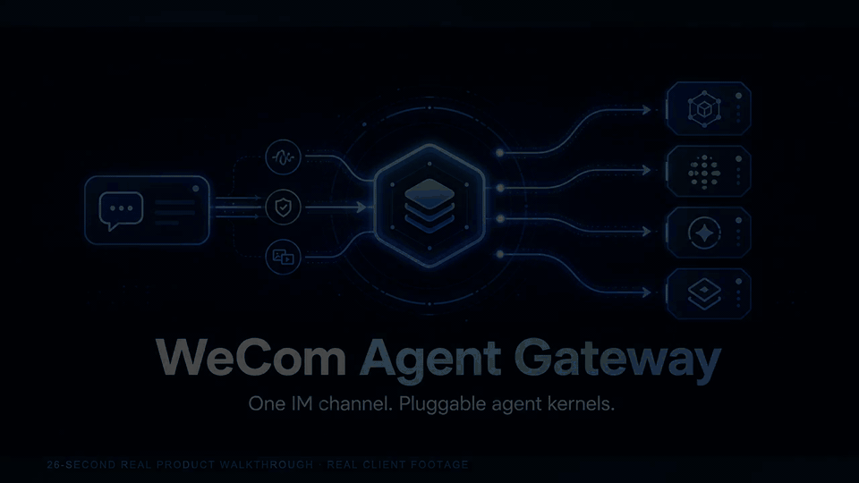
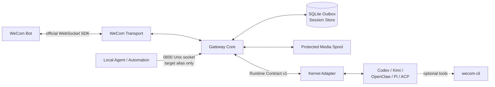

<p align="center">
  
</p>

<p align="center">
  <a href="https://github.com/fyaic/wecom-agent-gateway/actions/workflows/ci.yml"></a>
  <a href="LICENSE"></a>
  <a href="package.json"></a>
  <a href="ROADMAP.md"></a>
</p>

<p align="center">
  <a href="#26-秒看懂"><strong>26 秒演示</strong></a> ·
  <a href="#快速开始"><strong>快速开始</strong></a> ·
  <a href="docs/verified-kernel-cases.md">真实案例</a> ·
  <a href="#已支持的-agent"><strong>Agent 支持</strong></a> ·
  <a href="docs/README.md">文档</a> ·
  <a href="README.en.md">English</a>
</p>

# WeCom Agent Gateway

把一个企业微信 Bot 变成 Codex、Kimi Code、OpenClaw、Pi Agent 及其他 Agent Kernel 的可靠 IM 入口。

**企业微信负责触达，Agent 负责思考，Gateway 负责把中间链路做好。**

用户在企业微信里像平常聊天一样发送文字、图片、文件或视频；Gateway 使用企业微信官方 SDK 接收消息，
维护会话与流式回复，再通过一个稳定的 Runtime Contract 交给所选 Agent。Agent 也可以沿同一条受控链路
主动发消息、返回媒体，或发起确认、选择和取消等原生交互。

> [!IMPORTANT]
> 本项目是独立社区项目，不是腾讯企业微信官方产品。只需要 OpenClaw 的用户应同时评估企业微信官方
> [`wecom-openclaw-plugin`](https://github.com/WecomTeam/wecom-openclaw-plugin)；本项目的重点是
> 多 Kernel、稳定 Runtime Contract 和独立可靠传输层。

## 为什么需要它

让一个 Agent “能回复企业微信”并不难；难的是把它长期、可靠地运行起来。每接入一个 Kernel 都重新实现
Bot 鉴权、心跳重连、群聊范围、媒体解密、会话恢复、流式更新、失败重试和安全边界，最终会得到多套
彼此不兼容的 Channel 插件。

WeCom Agent Gateway 把这些重复工作收敛为一层：企业微信侧只实现一次，Agent 侧只写一个小型 Adapter。
更换 Kernel 不需要重做企业微信链路，升级交互或可靠性也不需要侵入 Agent 的推理循环。

## 一条消息如何流动

```text
企业微信用户 ⇄ 官方 Bot WebSocket ⇄ Gateway ⇄ Kernel Adapter ⇄ Agent
    文字 / 图片 / 文件 / 视频       会话 / ACL / 流式 / Outbox       推理 / 模型 / 工具
```

1. Gateway 在白名单检查后立即确认收到，不让用户面对长时间空白；
2. 文本和媒体被归一化为与厂商无关的消息，按会话严格有序交给 Agent；
3. Agent 的显式状态和文本增量原位更新同一条 Bot 消息，最终回复进入耐久 Outbox；
4. Agent 原生请求确认、选择或取消时，Gateway 可投影为企业微信卡片并把结果恢复到原会话；
5. Agent 也能通过受控本地接口主动向已授权私聊或群聊发送文本与媒体。

## 26 秒看懂

<p align="center">
  <a href="docs/assets/demo/wecom-agent-gateway-demo.mp4">
    
  </a>
</p>

<p align="center"><em>真实 macOS 企业微信客户端与真实 Pi Agent：即时状态、最终回复、原生确认卡片、同任务恢复，以及 Agent 主动文本/图片。点击动画打开高清 MP4。</em></p>

演示使用正式 Gateway、官方 Bot SDK 和受控主动消息接口完成，不是 UI mock。公开资产只保留聊天内容区，
已裁掉会话侧栏、账号名称、内部 ID 和凭据；默认普通回复不会附带卡片。

## 快速开始

### 先验证仓库，不需要企业微信或模型凭据

```bash
git clone https://github.com/fyaic/wecom-agent-gateway.git
cd wecom-agent-gateway
pnpm install --frozen-lockfile
pnpm run ci
```

超过 230 项 deterministic tests 会经过 Runtime Contract、Gateway Core、官方 SDK 映射、会话、流式、媒体、
Outbox、交互 Broker 和全部参考 Adapter，不消耗模型额度，也不会连接真实 Bot。

### 接入真实企业微信与一个 Agent

准备 Node.js 22、pnpm 11.8.0、一个开启长连接/API 模式的企业微信智能机器人，以及一个能独立运行的
Agent Kernel。然后创建仅保存在本机的配置：

```bash
cp .env.example .env
chmod 600 .env
```

最小示例使用本地 OpenClaw；也可以改选下表中的其他 Adapter：

```dotenv
WECOM_BOT_ID=
WECOM_BOT_SECRET=
GATEWAY_ADAPTER=openclaw
OPENCLAW_GATEWAY_URL=ws://127.0.0.1:18789
```

先注册一个允许访问 Gateway 的私聊，不需要复制或公开任何内部 ID：

```bash
pnpm enroll:direct --name '授权测试成员'
```

命令会显示一次性口令；在该成员与 Bot 的私聊中发送口令，注册完成后再检查并启动：

```bash
pnpm doctor
pnpm start:checked
```

Gateway 在 allowlist 为空时拒绝启动；`.env`、SQLite、日志和媒体目录不会进入 Git。更完整的最短
接入说明见 [`15 分钟接入指南`](docs/getting-started.md)；群聊授权、完整真实收发步骤和 smoke
命令见 [`真实企业微信联调手册`](docs/real-wecom-runbook.md)。群聊名称解析使用已授权的 `wecom-cli`，
不要求用户手工处理会话 ID。生产部署见 [`docs/deployment.md`](docs/deployment.md)。

## 你会得到什么

| 能力             | Gateway 提供的语义                                                                      |
| ---------------- | --------------------------------------------------------------------------------------- |
| 官方企业微信链路 | 复用官方 SDK 的鉴权、心跳、重连、媒体下载/解密、流式回复和主动推送                      |
| Kernel 中立接入  | Core 不依赖模型厂商；Codex、ACP/Kimi、OpenClaw、Pi 与外部 Adapter 共用 Runtime Contract |
| 对话与多模态保真 | 私聊、群聊、引用上下文、文字、图片、文件和视频二进制按能力精确协商，不伪造占位          |
| 丝滑 Bot UX      | 即时回执、同一消息流式更新、显式状态/emoji，以及可选确认、选择、审批和取消卡片          |
| 可靠双向投递     | SQLite Outbox、重试、死信、崩溃恢复、受保护媒体 spool 和授权范围内的 Agent 主动消息     |
| 安全与运维       | 分域 ACL、最小子进程环境、写工具审批、隐私日志、健康检查、Prometheus、systemd/容器基线  |

## 已支持的 Agent

| Adapter   | 上游接口               | 已验证能力                                                                      |
| --------- | ---------------------- | ------------------------------------------------------------------------------- |
| Codex     | SDK / App Server JSONL | 流式、恢复、回复动作、原生提问、取消、状态、审批、动态工具、图片/音频           |
| Kimi Code | ACP v1 stdio           | 流式、恢复、回复动作、取消、权限、状态、图片                                    |
| 通用 ACP  | ACP v1 stdio           | 按 `initialize` 动态协商恢复、回复动作和输入模态                                |
| OpenClaw  | Gateway WebSocket v4   | 流式、恢复、回复动作、取消、状态、图片/音频/视频/文件                           |
| Pi Agent  | 官方严格 LF JSONL RPC  | 流式、恢复、回复动作、取消、状态、动态图片输入、有界 worker pool、原生 ask-user |

每个 Gateway 进程只选择一个确定的 Kernel，不根据自然语言动态切换。第三方 Kernel 可以按照
[`docs/adapter-authoring.md`](docs/adapter-authoring.md) 使用 `@fyaic/wecom-adapter-sdk` 实现小型
Adapter，并通过 `GATEWAY_ADAPTER=external` 加载，无需修改 Gateway Registry。仓库内的
[`examples/adapter-template`](examples/adapter-template) 是可运行模板；
[`clean-room-adapter`](examples/clean-room-adapter) 的运行时代码只依赖公共 SDK，并有可重复的
[`机器认证报告`](docs/evidence/adapter-conformance-clean-room.json)。运行
`pnpm conformance:adapter --module <adapter>` 可在不连接企业微信的情况下检查第三方 Adapter。
Claude Code 另有一个使用官方 Agent SDK 的[隔离 C0 实验包](packages/adapter-claude-code)，目前只完成
确定性的文本/流式/session/取消协议验证，未注册进默认 Gateway，也不属于下方真实验证矩阵。
Channel 侧同样有版本化扩展边界：无厂商依赖的
[`transport-loopback`](packages/transport-loopback) 已通过固定
[`22 项机器报告`](docs/evidence/transport-conformance-loopback.json)。新 IM 可以实现 Transport v1，
但仍需独立证明厂商鉴权、回调和客户端可见性，不能把接受回执当作用户已看到。

真实企业微信端到端案例、代表性延迟和复现入口见
[`docs/verified-kernel-cases.md`](docs/verified-kernel-cases.md)。

交互卡片的完整设计和里程碑见 [`docs/interaction-cards.md`](docs/interaction-cards.md)。
无副作用的 Pi 原生交互示例见 [`examples/pi-wecom-interaction.mjs`](examples/pi-wecom-interaction.mjs)。

## 它与相邻项目的关系

| 方案                          | 最适合的场景                                    | 与本项目的关系                                                 |
| ----------------------------- | ----------------------------------------------- | -------------------------------------------------------------- |
| 企业微信官方 OpenClaw 插件    | 只需要把 OpenClaw 快速接入企业微信              | 优先评估的官方方案；本项目面向多 Kernel 和独立可靠性层         |
| `wecom-cli` / `wecom-unified` | 让 Agent 操作通讯录、日程、待办、文档等办公能力 | 可选工具层，不承担持续 IM 会话接入                             |
| 自建 Webhook Bot              | 固定命令、通知或轻量业务自动化                  | 适合简单业务；本项目增加会话、流式、多模态、Adapter 与耐久投递 |
| **WeCom Agent Gateway**       | 用同一条企业微信链路承载不同 Agent Kernel       | 统一 Channel 能力，同时保持 Agent 的模型、推理和工具自主权     |

它不是新的 Agent 框架，也不会代替模型、OpenClaw 或 Codex。它处在企业微信与 Agent 之间，像一个
专门为 Agent 会话设计的 IM 基础设施层。

## 架构与边界



- WeCom Transport 负责官方 Bot 协议和媒体传输；
- Gateway Core 负责顺序、去重、会话、能力检查、流式投影和持久投递；
- Adapter 只翻译某个 Kernel 的 SDK/RPC、session 和 events；
- Kernel 拥有模型、推理、工具、工作区和 transcript；
- `wecom-cli` 是可选办公工具层，不承担 IM 接入，也不提供真人身份替代；
- 本地主动控制面只提交别名和消息，仍复用同一 Bot、Outbox 和官方 SDK。

> [!NOTE]
> 主线优先级始终是 IM 接入、消息归一化、会话与媒体保真、可靠投递和稳定 Adapter Contract。
> 卡片只是 Transport 能力允许时的可选交互投影，默认普通回复不会附卡，也不能改变 Agent 的推理语义。

## 企业微信能力

- Bot WebSocket 鉴权、心跳和重连；
- 私聊与群聊 `@Bot`；
- 文本和 Agent 显式状态的可变流式回复；
- 引用/回复消息的结构化上下文保真，引用媒体复用同一受保护生命周期；
- 官方非阻塞流式背压、最终帧保证和可选回复反馈；
- 可选静态 `enter_chat` 欢迎语，不启动 Kernel；
- 图片、文件、视频下载/解密和受保护临时物化；
- 图片、语音、视频、文件上传与主动推送；
- 分域 sender/conversation allowlist；
- 会话恢复、入站去重、背压和分层延迟事件；
- 持久文本/媒体 outbox、重试、死信和恢复；
- 可选 `wecom-cli` 只读工具和审批后写工具。
- Channel-neutral 五类模板卡片，以及绑定发送者/会话的审批按钮卡片与文本降级。
- 耐久 Interaction Broker：确认、单选、多选、表单、TTL 与同 session 异步恢复。
- Pi 原生 select/confirm/input/editor：卡片或限定文本回复后恢复原 tool call，不注入 Prompt。
- 最终回复快捷动作：Codex、ACP/Kimi、OpenClaw、Pi 和外部模板均以同 session 新回合续接，重复 callback 不创建第二轮。
- 长任务取消卡：仅对声明 `cancel` 的 Adapter 出现，按发送者/会话持久绑定，快速任务和不可取消 Kernel 不展示。

企业微信语音回调目前只提供官方转写文本时，Gateway 不会虚报原始音频输入。媒体能否被 Agent
进一步理解取决于所选 Kernel 及其工具，而不是传输层。

## 让 Agent 主动发消息（可选）

显式设置 `GATEWAY_CONTROL_ENABLED=true` 后，唯一 scoped 私聊和群聊会自动获得 `direct`、`group`
别名。客户端不读取 `.env`，只连接权限为 `0600` 的本地 socket：

```bash
pnpm proactive:health
pnpm proactive:send --target direct --text '构建已经完成。'
pnpm proactive:send --target group --file /allowed/report.pdf --media-type file
```

多目标必须使用 `GATEWAY_PROACTIVE_TARGETS_JSON` 显式配置别名，而且每个目标仍须在对应 scoped
allowlist 内。媒体路径还必须位于 `WECOM_MEDIA_OUTPUT_ROOTS` 允许目录。

## 可靠性与安全语义

- 同一会话严格有序，不同会话可以并行；
- 同一 Bot 的第二个本机 Gateway 在连接官方 SDK 前快速失败；跨主机 active-active 仍不受支持；
- 投递语义是 **at-least-once**，不是 exactly-once；
- 流式窗口过期时，最终文本可降级为官方主动推送；
- 入站媒体只在单次 run 内临时存在，结束后清理；
- 出站媒体先复制到 Gateway 控制的 spool，并校验大小与哈希；
- 只有 `WECOM_MEDIA_OUTPUT_ROOTS` 下的普通文件允许外发；
- 写工具必须经过与发送者、会话和 run 绑定的持久审批；
- Adapter 子进程默认只继承最小运行环境；额外变量必须按 Adapter 显式 allowlist，Bot secret 不会下传；
- SDK 原始消息和 Adapter stderr 默认不写日志；显式开启诊断时仍会对已知凭据和值字段脱敏；
- SQLite schema 版本不兼容时拒绝启动；终态运行数据默认保留 30 天并分批清理，pending/leased/dead 工作不被删除；
- 普通网络故障默认无限重连，鉴权失败仍有独立有限重试上限；私有 SDK 端点只接受不含凭据的 `wss://` URL。

完整设计见 [`docs/architecture.md`](docs/architecture.md) 和
[`ADR`](docs/README.md)。安全问题请按 [`SECURITY.md`](SECURITY.md) 私下报告。

## 成熟度

项目处于 **Public Preview**，尚未承诺稳定的 v1 API。当前有超过 230 项 deterministic tests，并完成
真实企业微信私聊、群聊、流式回复、会话恢复、图片/文件/MP4、主动媒体、受管重启及四类 Kernel
接入验证。真实 OS 子进程 `SIGKILL` 后的 SQLite Outbox 租约恢复、macOS 受管 Gateway 强杀拉起和
重新鉴权也已通过；隔离 Linux 网络断开/恢复、持久卷只读和受限 tmpfs 容量耗尽均完成真实故障验收。
宿主机物理网卡中断、原生 `msgtype=video` 客户端回调和跨主机多实例 fencing/全局顺序仍在路线图中。

- 当前能力与真实验收：[`docs/status.md`](docs/status.md)
- 路线图：[`ROADMAP.md`](ROADMAP.md)
- 变更记录：[`CHANGELOG.md`](CHANGELOG.md)

## 按目标阅读文档

| 如果你想……               | 从这里开始                                         |
| ------------------------ | -------------------------------------------------- |
| 看真实 Agent 接入效果    | [真实 Kernel 案例](docs/verified-kernel-cases.md)  |
| 接入一个真实企业微信 Bot | [15 分钟接入指南](docs/getting-started.md)         |
| 执行完整真实验收         | [真实企业微信联调手册](docs/real-wecom-runbook.md) |
| 增加另一种 Agent         | [Adapter 开发指南](docs/adapter-authoring.md)      |
| 增加另一种 IM Channel    | [Transport 接入指南](docs/transport-authoring.md)  |
| 理解卡片和交互回调       | [交互卡片设计](docs/interaction-cards.md)          |
| 部署和运维 Gateway       | [生产部署基线](docs/deployment.md)                 |
| 检查官方上游兼容性       | [上游兼容矩阵](docs/upstream-compatibility.md)     |
| 核对当前能力和已知缺口   | [项目状态](docs/status.md) 与 [路线图](ROADMAP.md) |

## 参与项目

欢迎提交可复现的 bug、文档改进和新的 Kernel Adapter。开始前请阅读
[`CONTRIBUTING.md`](CONTRIBUTING.md)、[`CODE_OF_CONDUCT.md`](CODE_OF_CONDUCT.md) 和
[`SUPPORT.md`](SUPPORT.md)。

## 许可证与上游声明

本项目采用 [MIT License](LICENSE)。第三方依赖、企业微信官方参考项目和源码来源规则见
[`THIRD_PARTY_NOTICES.md`](THIRD_PARTY_NOTICES.md) 与
[`docs/licensing.md`](docs/licensing.md)。

WeCom、企业微信、Tencent、Codex、Kimi、OpenClaw 和 Pi 等名称与商标归各自权利人所有。
