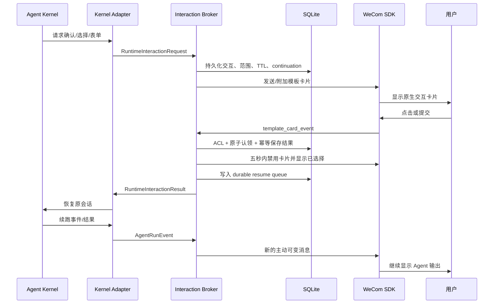
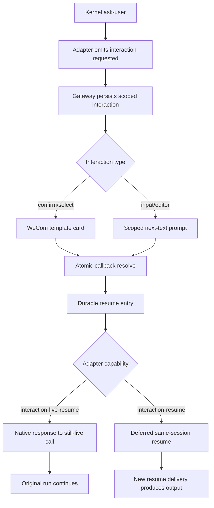
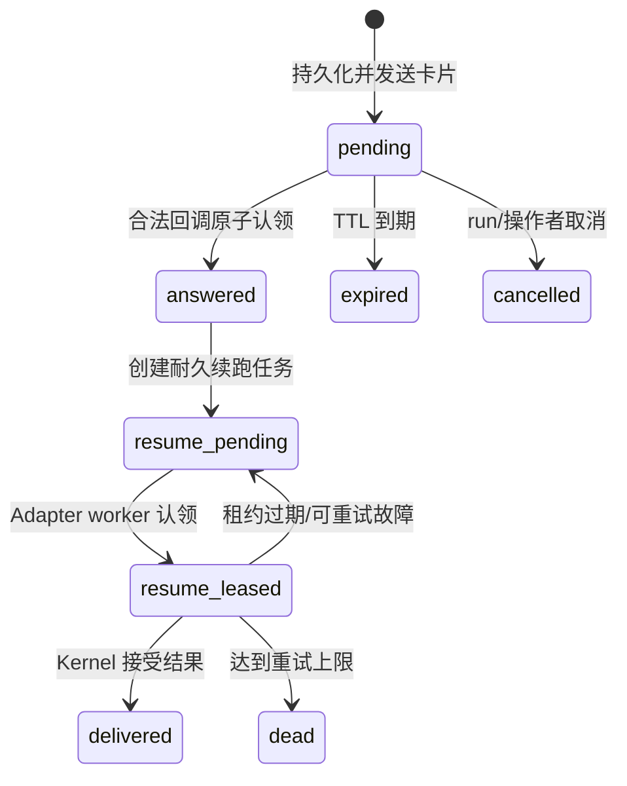
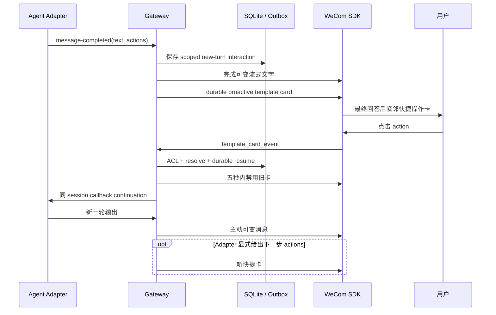
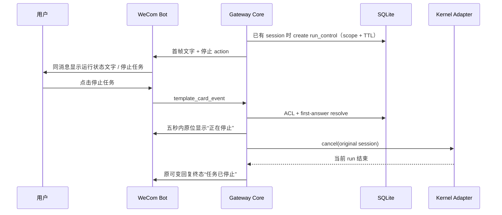
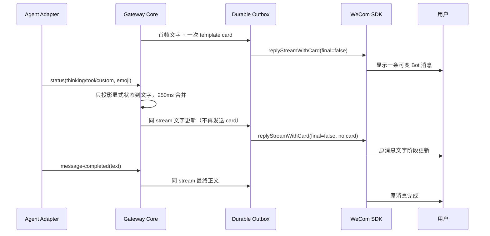

# Agent 交互卡片设计

更新于 2026-08-28。

## 目标

卡片不是更漂亮的消息，而是 Gateway 的通用交互协议。企业微信只负责呈现和回调，Gateway 负责
交互状态、权限、幂等、过期与续跑，Kernel Adapter 负责把通用请求和结果翻译为各 Agent 的原生
能力，`wecom-cli` 负责选择完成后的待办、日程、会议、文档、邮件等办公动作。

项目不让 Agent 生成企业微信 `template_card` JSON，也不把企业微信 callback frame 直接交给
Kernel。公共边界只表达确认、单选、多选、表单和快捷操作等语义。

## 官方能力与分工

官方 [`@wecom/aibot-node-sdk`](https://github.com/WecomTeam/aibot-node-sdk) 提供五类模板卡片、
`replyTemplateCard`、`replyStreamWithCard`、主动 `sendMessage`、
`event.template_card_event` 和 `updateTemplateCard`。更新必须使用对应回调的 `req_id`，并在收到
事件后五秒内完成。

官方 [`wecom-cli`](https://github.com/WecomTeam/wecom-cli) 的消息能力当前主要承担会话读取、媒体
获取和文本发送；卡片的发送、回调和原位更新属于 Bot SDK Transport。CLI 在用户完成选择或审批后
执行精确的企业微信办公业务工具，两层不混用身份或协议。

官方 OpenClaw 仓库的
[`交互卡片 PR #176`](https://github.com/WecomTeam/wecom-openclaw-plugin/pull/176) 已验证按钮单选、
投票单/多选、多问题聚合、TTL、重复点击和真实企业微信 E2E。它采用内存 pending 注册表和 synthetic
文本注入；本项目复用其已验证的 WeCom 语义，但使用 SQLite、Runtime Contract 和 Adapter continuation
替代不可恢复的内存状态与厂商绑定注入。

## 端到端链路



五秒回调路径不等待 Agent。它只做授权、入站去重、SQLite 原子决定、卡片更新和续跑任务入队；
Kernel 的启动、排队、推理和工具执行全部在该路径之外。

## 通用交互语义

| Agent 意图      | 企业微信渲染                       | 典型场景                     |
| --------------- | ---------------------------------- | ---------------------------- |
| `confirm`       | `button_interaction`               | 确认、取消、批准、拒绝       |
| `single-select` | `vote_interaction` 纵向单选        | 环境、联系人、处理方式       |
| `multi-select`  | `vote_interaction` 多选            | 文件、范围、参与人           |
| 多字段选择      | `multiple_interaction`             | 环境、优先级、执行时间       |
| `actions`       | `button_interaction`               | 展开、导出、建待办、继续处理 |
| 无选项开放问题  | Markdown / 普通文本                | 用户自由输入                 |
| 结果摘要        | `text_notice` / `news_notice`      | 报告、任务状态、链接导航     |
| 一项选择加确认  | `button_selection` + `button_list` | 选择目标后确认执行           |

当前公共展示契约只保留 `notice`、`article`、`actions`、`choice`、`form` 五种稳定语义。企业微信的
`source`、`horizontal_content_list`、`emphasis_content`、`quote_area`、`jump_list` 等增强字段留给
M2.5 的 Channel-neutral presentation 扩展，不提前把厂商字段写进 Runtime Contract。

### 文案与颜色语义

- 等价选项一律使用纵向 choice，不用横排按钮，也不把第一项渲染成蓝色；蓝色提交按钮只表示明确的
  “完成选择”动作，不能暗示第一个候选更推荐。
- confirm 的确认按钮默认 primary、取消按钮 default；危险操作只有在 Adapter 显式声明 danger 时才用
  红色。通用 actions 同样必须显式声明 style，Core 不从位置或文字猜测颜色。
- 选项标签保持原文，不按企业微信 SDK 的“建议 10/11 字”静默截断。Runtime 单项上限仍为 100 字；
  Transport 使用更有纵向空间的 vote 布局。超过真实客户端可读范围时应改用分层选择或正文展示，不能
  以省略号改变选项含义。
- 当前智能机器人端对无跳转 `text_notice` 的更新与 SDK 示例不一致：`card_action` 省略或设为
  `{type: 0}` 都返回 `42045`。结果状态因此保持为交互卡语义，使用 update-only 的
  `checkbox.disable=true` 和已勾选“已完成”；不添加虚假跳转链接。真实服务端仍强制要求
  `submit_button`，因此保留同名“已完成”按钮，重复回调只返回既有状态且不恢复 Agent。

## Runtime Contract

Agent-facing 请求只包含稳定语义：

```ts
type RuntimeInteractionRequest =
  | { kind: "confirm"; title: string; description?: string }
  | {
      kind: "single-select";
      title: string;
      options: InteractionOption[];
    }
  | {
      kind: "multi-select";
      title: string;
      options: InteractionOption[];
      min?: number;
      max?: number;
    }
  | { kind: "form"; title: string; fields: InteractionField[] }
  | { kind: "actions"; title: string; actions: InteractionAction[] };
```

Gateway 返回给 Adapter 的结果不含 `task_id`、callback `req_id`、企业微信用户或会话 ID：

```ts
interface RuntimeInteractionResult {
  interactionId: string;
  status: "submitted" | "cancelled" | "expired";
  values: Record<string, string[]>;
  submittedAt: string;
}
```

Adapter 可以从 Kernel 原生 ask-user/elicitation、受控 `channel_interact` 工具、OpenClaw/Pi extension
或其他协议产生通用请求。Core 不关心具体 Kernel。通用默认采用 deferred suspend/resume：交互发出
后结束当前 run，回调结果通过耐久 resume queue 恢复相同 session。原地长时间等待 tool call 只作为
声明过原生能力的可选优化，不能成为公共可靠性基线。

M2.2 增加了 `text-input` 语义和 Kernel 主动事件：

```ts
type RuntimeInteractionRequest =
  | /* confirm / single-select / multi-select / form / actions */
  | {
      kind: "text-input";
      title: string;
      fieldId: string;
      description?: string;
      placeholder?: string;
      initialValue?: string;
      multiline?: boolean;
    };

type AgentRunEvent =
  | { type: "interaction-requested"; request: RuntimeInteractionRequest }
  | /* existing runtime events */ never;
```

卡片交互继续走官方 SDK callback；`text-input` 不伪造企业微信表单，而是发送清晰提示，并只消费同一
account、conversation、sender 下的下一条非空纯文本。该回复直接完成 pending interaction，不创建
第二个 Agent turn，也不进入模型意图识别。

## Live resume 与 deferred resume



`interaction-live-resume` 是控制响应，不是新的语义 turn。它必须绕过 Gateway 的会话队列和 Agent run
semaphore，否则原 run 等待用户、resume 又等待原 run 释放槽位，会形成死锁。它只允许路由到仍持有
该 session 的 live worker。默认 `interaction-resume` 仍走耐久队列、租约和串行调度，供真正挂起并
结束当前 run 的 Kernel 使用。

Pi `0.84.2` 的 RPC `select/confirm/input/editor` 会发送 `extension_ui_request` 并阻塞，直至收到同 ID 的
`extension_ui_response`。Pi Adapter 将选择/确认映射为卡片，将 input/editor 映射为上述纯文本回复；
返回结果使用 Pi 原生 response 恢复原 tool call，而不是合成一条 Prompt。带 Pi 自身 `timeout` 的 dialog
暂时 fail closed 并立即取消，避免 Kernel timeout 与 Gateway TTL 两套计时器竞争。

## Interaction Broker 状态机



回调按 `account + conversation + sender + interaction` 绑定。callback `msgid` 与交互原子状态共同去重；
重复点击返回既有结果，不重复恢复 Agent。跨进程只承诺 Agent resume 的 at-least-once 投递，并向
Adapter 提供稳定 idempotency key；不能虚假声称外部 Kernel 已具备 exactly-once 语义。

## 回调 UX

1. 用户点击后立即把卡片替换为不可交互状态，例如“✅ 已选择：生产环境 · 正在继续”。
2. 卡片只确认用户提交的内容，不等待 Agent 工具执行结果。
3. callback `req_id` 被卡片更新消费后，不再用于 Agent 回复；续跑输出使用新的主动可变消息。
4. TTL 到期但没有 callback frame 时无法原位更新旧卡，只主动发送一次简短过期提醒。
5. 首帧已知的卡片才使用 `replyStreamWithCard`；最终完成时才确定的快捷动作紧随文字以主动卡片发送。

目标指标：`callback → SQLite commit` p95 小于 100ms，`callback → card update` p95 小于 800ms，
`callback → resume enqueue` p95 小于 150ms。Kernel 首事件、首文本和完成耗时继续单独统计。

## 与 wecom-cli 的组合

```text
wecom-cli 读取联系人/日程/文档候选
        ↓
Agent 返回单选或多选卡
        ↓
用户提交结构化选择
        ↓
Adapter 恢复 Agent session
        ↓
Gateway 展示精确写操作审批卡
        ↓
wecom-cli 执行待办/日程/会议/文档/邮件动作
```

普通 `agent.elicitation` 只表达澄清，不授权副作用。只有 Gateway `control.approval` 卡片可以批准一次
已经绑定具体参数的写工具调用；`workflow.action` 只路由到显式注册的确定性工作流。三者使用不同
namespace、状态和视觉标识，防止 Agent 生成的“确认”冒充安全审批。

## 群聊边界

第一阶段交互只允许原请求人回答。公开投票是独立模型：响应表以
`(interaction_id, sender_id)` 去重，并需要截止时间、人数/可见范围、聚合和按用户更新语义；它不能
复用一次性确认状态机。多人审批、匿名投票和 quorum 不进入首个里程碑。

## 安全与容量

- `task_id`、action key 和 callback namespace 全部由 Gateway 生成。
- Agent 只收到自己请求中稳定 option value 的选择结果，不接触 WeCom ID。
- URL 默认禁用；需要时只开放 credential-free HTTPS hostname allowlist。
- M2.2 接入 Agent ask-user 时默认限制每会话一个活跃 elicitation；当前单次表单最多 3 个字段，并限制
  选项、正文和持久结果大小。
- 未知、跨会话、跨发送者、过期和重复回调 fail closed，但向合法点击者返回稳定、无内部信息的 UI。
- Interaction resume 进入现有背压、租约、重试、死信、脱敏日志和 readiness 体系。

## 里程碑

### M2.1：Interaction Broker

状态：2026-08-25 已完成确定性闭环，真实企业微信私聊单选已通过；表单和群聊待执行。

- [x] Agent-neutral Request/Result 和 `interaction-resume` capability 契约。
- [x] SQLite 完整交互状态机、TTL sweep 与 durable resume queue。
- [x] 五秒 callback fast lane、即时 UI 更新和主动回复边界。
- [x] deterministic adapter 验证单选、多选、取消、过期、重复、ACL 和同 session 恢复。
- [x] SQLite 验证原子 resolve/enqueue、租约恢复、退避重试和完成去重。

实现入口：

- `packages/runtime-contract/src/index.ts`：请求、结果、continuation 与 Store 契约；
- `packages/channel-core/src/gateway.ts`：Broker、回调 fast lane、resume worker 和安全映射；
- `packages/storage-sqlite/src/index.ts`：交互状态与恢复租约；
- `packages/transport-wecom-bot/src/index.ts`：官方 SDK 卡片渲染、callback normalization 和五秒更新。

### M2.2：Agent ask-user MVP

状态：2026-08-25 已完成 Pi 原生 hook、live resume 与文本降级的实现和自动化验证；真实企业微信
私聊单选、私聊限定文本输入和群聊单选均已通过。

- [x] `interaction-requested` Adapter hook 和 `text-input` 中立契约。
- [x] Pi `select/confirm/input/editor` 原生 RPC 映射，不注入 synthetic Prompt。
- [x] `interaction-live-resume` 控制快车道，同 session、同 worker 恢复且不与原 run 死锁。
- [x] 每 account + conversation 最多一个活跃交互；文本回复额外绑定原 sender。
- [x] durable resume 仍作为 callback 决定和 at-least-once 投递记录。
- [x] 本机真实 Pi RPC extension UI request/response 冒烟。
- [x] 授权企业微信私聊真实单选、结果原位更新和重复回调幂等验收。
- [x] 授权企业微信私聊 input：scoped next-text 消费、原 run 恢复且不创建第二 turn。
- [x] 授权企业微信测试群 select：group-only ACL、原位更新、原 run 恢复与最终回复。
- [x] 跨发送者拒绝、群聊 input sender 绑定由 deterministic tests 覆盖；真实跨成员测试不冒充执行。

2026-08-25 首轮授权私聊中，Pi select 原 run 完整恢复并最终回复“测试完成”；用户多次点击只产生一个
durable resume，证明业务幂等成立。但原位结果卡因无动作 notice 携带 `{card_action:{type:0}}` 被真实
服务端以 `42045` 拒绝，且三项横排按钮发生文案显示不全、第一项无语义地呈蓝色。该轮记为“功能部分
通过、UI 失败”，不计入最终 E2E 通过；上述规则修复后必须重测。

第二轮已验证纵向单选发送成功，用户提交后 1ms 内只完成一次 live resume，Pi 原 run 继续完成；但按
官方示例省略 `card_action` 的 `text_notice` 仍被真实服务端以相同 `42045` 拒绝。第三轮因此改为禁用的
`vote_interaction` 结果态。

第三轮证明禁用 checkbox 被服务端接受，但省略 submit button 会返回 `42049
submit_button.text Missing or Invalid`。第四轮完成态补齐必填的“已完成”按钮；真实旧卡重复提交后，
企业微信接受原位更新且没有错误，durable resume 仍保持恰好一次。该结果同时关闭 UI 收敛与业务幂等
验收，未把重复按钮动作误送给 Agent。

同日私聊 `text-input` 真实请求在 17.744 秒后收到用户输入，Broker 在 1ms 内完成 live resume；日志只有
交互 submitted/resume 事件，没有把输入消息启动为第二个 Agent turn。原 Pi run 原样复述输入，全部
回复投递无错误。

授权测试群 select 同日通过：group-only ACL 放行，Channel 回执 440ms、Pi 首文本 3.847 秒；16.433 秒
收到提交后 1ms 恢复原 run，两个 interaction update 和最终回复均无错误，25.676 秒完成。真实环境未
提供第二位真人，因此跨发送者拒绝仍只声明 deterministic 覆盖，不扩大真实验收结论。

可运行的无副作用 Pi 示例位于 `examples/pi-wecom-interaction.mjs`；它只在 Agent 明确调用时展示选择、
确认或输入，不执行办公写操作。

### M2.3：最终回复快捷操作

状态：完成；2026-08-26 客户端验收暴露组合流首帧类型、重复完成态和默认动作自续循环，修复后真实
私聊复测通过。

- [x] `message-completed.actions` 与操作员默认 action 的 Runtime-neutral 契约。
- [x] 最终文字完成后通过 durable proactive path 紧邻发送动作卡；Transport 保留首帧组合卡能力。
- [x] SQLite 保存发送者、会话、Adapter、session、TTL 和动作值；新卡替换同会话旧快捷卡。
- [x] 点击后先原位更新，再以 `resumeMode=new-turn` 进入正常队列恢复相同 Agent session。
- [x] 过期静默失效、重复点击不重复 continuation、写工具仍走独立审批。
- [x] 操作员默认 action 只用于普通入站首轮；callback continuation 不继承默认卡，杜绝自续循环。
- [x] Pi 已结束 session 的 action continuation 与四层 deterministic tests。
- [x] 授权企业微信私聊真实独立快捷卡、点击续跑、完成态、重复点击与一次性默认动作验收。

连续两轮实测证明，最终帧首次携带卡片即使得到服务端成功回执，桌面端仍只显示文字。官方示例把模板卡
放在首次回复，说明这不是可靠的 late-binding 接口。最终动作只有 `message-completed` 时才确定，因此
Gateway 不再伪装成同消息组合：先完成原可变文字，再通过同一 durable Outbox 紧邻发送独立主动卡片。
另一个并发问题是已完成卡片的重复回调仍触发 UI 更新，真实客户端会出现第二张“操作结果”；Gateway
现对 `interaction_*` 的已处理、过期和被替换 callback 静默幂等，审批卡仍通过独立 `approval_*`
namespace 处理。



快捷 action value 是 Adapter 或操作员预先绑定的规范化 continuation，不是 Gateway 从 label 猜出的
Prompt，也不是可执行命令。`interaction-live-resume` 只服务仍在等待的 ask-user；最终回复动作已经是
新的语义 turn，必须进入正常会话队列、并发限制和背压。

`GATEWAY_REPLY_ACTIONS_JSON` 是一次性默认入口：只附加于用户普通消息对应的最终回答。它不会在自身
callback continuation 完成后再次出现，否则“点击 → 续跑 → 同卡 → 再点击”会形成没有自然终点的交互
循环。Adapter 若确实实现向导式多步流程，必须在每一步显式返回新的 `actions`，并自行定义终止条件。

修复后真实私聊复测记录：普通入站在 446ms 完成 Channel 回执，9.693 秒出现 Kernel 首文本，10.812 秒
完成回答并仅投递一张快捷卡；用户点击后 durable resume 完成同 session continuation，只投递新的主动
文字，没有第二条 `proactive-presentation`。测试结束时 Outbox 为零 pending、零 leased、零 dead，证明
该链路在一次点击后自然终止。

### M2.4：多 Kernel

状态：2026-08-26 已完成最终回复动作的多 Kernel deterministic 闭环，并完成原生 ask-user 协议审计；
只接入上游真实存在的方法，不以合成 Prompt 冒充。

- [x] Codex SDK / App Server、Pi、OpenClaw、ACP 的同 session new-turn reply-action continuation。
- [x] ACP 仅在上游声明 `loadSession` 时开放 `interaction-resume` 与 `reply-actions`。
- [x] 外部 Adapter SDK 接受并校验三项 interaction capability 与 `resumeInteraction()` 方法一致性。
- [x] 公共 testkit 验证续接完成和同 idempotency key 重复投递不产生第二 turn。
- [x] Codex App Server 原生 `item/tool/requestUserInput`：单选、表单、自由输入、多步续接与 secret
      fail-closed，不创建第二 turn。
- [x] 明确上游边界：当前 ACP v1 只有工具 permission，OpenClaw Gateway v4 没有外部 elicitation
      response；两者不虚报 `interaction-live-resume`，未来协议新增正式方法后再评估。

### M2.5：高级交互

- [x] 长任务取消卡：已有 session 首帧展示；sender/conversation ACL、SQLite 首答、原位确认、原生
      cancel、正常完成/过期/重复/重启陈旧卡 fail closed；无组合流时阈值后主动降级。
- [x] 首帧呈现与动态状态文字：template card 只回复一次；显式 Agent status/emoji 与文本增量合并。
- [ ] 欢迎卡与主动任务卡。
- 独立群投票和多人聚合模型。
- 卡片模板主题与 Agent 品牌标识。

长任务取消切片的数据流：



`run_control_*` 不进入 Agent 消息、不授予工具权限，也不恢复已结束 session。正常完成时 pending control
立即标记 completed；旧卡第一次点击只收敛为“任务已经结束”，之后重复静默。进程重启只保留陈旧卡
安全性，不尝试复活已经消失的 live run。首轮无 session 时不伪造 cancel；不支持首帧组合卡的
Transport 使用阈值后的独立主动卡降级。

2026-08-28 已完成真实企业微信私聊验收：阈值后停止卡正常可见，一次点击只原子结算一条
`resolved/cancel` 控制记录，绑定的 Pi run 在 21.045 秒进入 `cancelled`。取消后没有继续完成原 run，
Outbox 保持零 pending/leased/dead，Gateway 继续 ready。该结果验证的是 Channel 控制面到 Adapter 原生
取消的闭环，不把模型行为纳入卡片语义。

同日首轮目视确认了可变状态文字，但任务在 18.561 秒完成前，15 秒阈值触发的独立停止卡已送达，最终
回复后仍显示“任务仍在执行”。随后 UI 自动验收又确认，stream 中把 `text_notice` 换成
`button_interaction` 并不可靠。官方 SDK 的根本约束是同一消息只能回复一次 `template_card`，因此最终
方案是已有 session 首帧直接发送停止 action，最终帧清除；不再尝试运行中换卡。

首帧呈现与动态状态文字的数据流：



这不是 Gateway 的任务规划器：后续“思考、工具运行或自定义阶段”必须由 Adapter 显式发出，并且只
更新文字。已有 session 且 Adapter 可取消时，首帧卡使用带 ACL、首答和原生 cancel 语义的停止 action；
否则可使用中性 notice。未声明 `status-events`、Transport 不支持组合流或配置
`GATEWAY_PROGRESS_PRESENTATION_ENABLED=false` 时，Gateway 保持纯文字可变回复。
