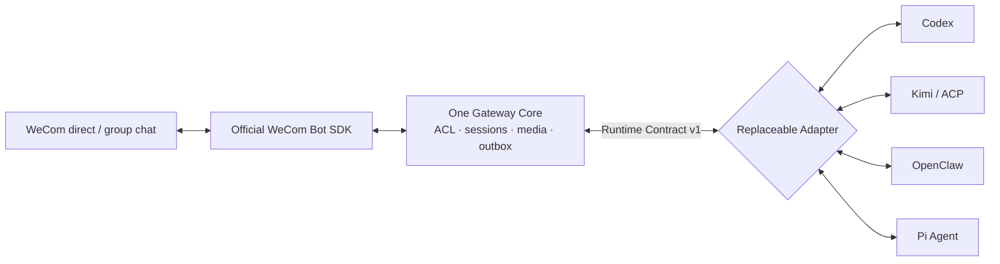

# Verified multi-kernel cases

This page separates real WeCom end-to-end evidence from local protocol smoke
tests and deterministic contracts. See [`status.md`](status.md) for the full
timeline and the [real WeCom runbook](real-wecom-runbook.md) for setup.



## Real-client snapshot

The recorded 26-second client path—immediate status, final reply, confirmation,
same-task resume, and proactive text/image—is available as a
[`GIF`](assets/demo/wecom-agent-gateway-demo.gif) or
[`high-resolution MP4`](assets/demo/wecom-agent-gateway-demo.mp4). Raw desktop
captures never enter the repository.


Captured from a real macOS WeCom Bot conversation on 2026-08-28 and cropped to
exclude the conversation sidebar. The ordinary message is answered through the
Pi Adapter; the earlier card came from a separate explicit interaction request.
Ordinary replies do not attach a default card.

## Historical evidence matrix

These successful records remain valid for their original interfaces, environments
and scenarios; they do not certify every currently installed dependency version.
The default Codex App Server and optional SDK are distinct Adapter paths, with
different capabilities and acceptance evidence.

| Kernel / Adapter | Upstream interface                     | Historically validated scope                                                                                            | Representative historical observation / date                                                                                             |
| ---------------- | -------------------------------------- | ----------------------------------------------------------------------------------------------------------------------- | ---------------------------------------------------------------------------------------------------------------------------------------- |
| Codex App Server | JSONL RPC; default starter             | Real WeCom direct/group, streaming, resume, image, dynamic tools and approval                                           | 2026-08-20 HTTP-only direct: ack 452ms, first text 3.88s, complete 5.12s                                                                 |
| Codex SDK        | Official TypeScript SDK; optional path | Early local real text smoke; automated snapshot streaming and resume-ID tests, not the image/tool/approval claims above | The original record did not separately identify that SDK version; it does not certify current SDK 0.153.2                                |
| Kimi Code        | ACP v1 stdio                           | Real WeCom direct text, same-session resume and image input                                                             | 2026-08-24 text: ack 418ms, first text 5.68s, complete 6.42s; image complete 13.23s                                                      |
| OpenClaw         | Gateway WebSocket v4                   | Real WeCom direct/group, resume and image/file/MP4                                                                      | 2026-08-24 resumed direct: ack 446ms, first text 8.46s, complete 9.98s; separate local two-turn success with client beta.3 on 2026-09-02 |
| Pi Agent         | Official strict-LF JSONL RPC           | Real WeCom direct/group, resume, image, worker pool, ask-user, approval and cancel                                      | 2026-08-24 two direct turns: ack 400/385ms, first text 3.919/2.638s, complete 4.610/3.382s                                               |
| Generic ACP      | ACP v1 stdio                           | Real child-process initialize, capability negotiation and load/cancel/image contract                                    | Kimi is the real WeCom end-to-end representative; other ACP harnesses need separate acceptance                                           |

### Latest retest status (through 2026-09-07)

| Adapter / version                 | Latest result                                                                                           | Evidence and interpretation                                                                                                                          |
| --------------------------------- | ------------------------------------------------------------------------------------------------------- | ---------------------------------------------------------------------------------------------------------------------------------------------------- |
| Codex App Server / CLI 0.145.0    | Local real two-turn/resume check passed on 2026-09-05                                                   | [Onboarding audit](onboarding-review.md); not a test of the new SDK                                                                                  |
| Codex SDK 0.153.2                 | Real two-turn check timed out after 120 seconds on 2026-09-07; no successful retest                     | [Dependency review](reviews/runtime-clients-2026-09-07.md); bounded shutdown passed separately; this does not establish a default App Server failure |
| Kimi Code 0.39.1 / ACP            | Local authentication-class failure on 2026-09-05                                                        | [Onboarding audit](onboarding-review.md); a missing local authentication prerequisite does not invalidate historical WeCom success                   |
| OpenClaw client 2026.9.1          | Local Gateway unavailable on 2026-09-07; real-host communication with the new client remains unverified | [Dependency review](reviews/runtime-clients-2026-09-07.md); local service unavailability is not evidence of Adapter incompatibility                  |
| Pi / existing local configuration | Fresh-directory real WeCom direct chat, proactive text and restart continuity passed on 2026-09-07      | [Fresh-directory run](reviews/fresh-real-onboarding-2026-09-07.md); existing accounts and this specific text scenario only                           |

Claude Code remains experimental and absent from the default starter. The SDK
0.3.260 local authentication check was signed out; successful real text/session/
cancel validation remains pending. See the [separate review](reviews/claude-sdk-0.3.260.md).

“MP4” in the OpenClaw row means that a real message reached the Adapter and
received a capability-aware response. It does not prove model video
understanding and cannot replace acceptance of a native `msgtype=video`
callback. Every media claim is scoped to the explicitly listed Kernel,
direction, and dated observation.

These measurements describe one dated local environment, not an SLA. Channel
acknowledgement and Kernel first-text latency are recorded separately so that
transport faults are not confused with model or Kernel reasoning time.

## External Adapter conformance evidence

The runtime code of the [`clean-room-adapter`](../examples/clean-room-adapter)
depends only on the public Adapter SDK; it imports no Core, Transport, or built-in
Kernel package. The independent runner passes text, streaming, session resume,
quoted context, image, reply-action idempotency, and cancellation: eight passed,
zero failed, and two undeclared optional lifecycle methods explicitly skipped.
CI keeps the fixed [JSON report](evidence/adapter-conformance-clean-room.json)
in sync.

This proves the extension contract, not a real Agent or WeCom E2E. A third-party
Kernel still needs its own deterministic fake, real Kernel smoke, and real WeCom
acceptance layers.

## What each case proves

- **Codex App Server** has real WeCom records for persistent sessions, dynamic
  tool approval and images. Native `item/tool/requestUserInput` (ask-user) has
  implementation and automated evidence only, not real-client acceptance.
  **Codex SDK** local text smoke is separate evidence: App Server tests do not
  certify the SDK path. Codex is a reference Kernel, not a Gateway runtime dependency.
- **Kimi / ACP** proves that the same Core can host a non-Codex Kernel over a
  standard protocol. Input capabilities are negotiated and unsupported media
  fails closed.
- **OpenClaw** connects through its public Gateway client rather than embedding
  the WeCom Channel plugin. OpenClaw retains models, tools, and transcripts.
- **Pi Agent** uses the official JSONL RPC and validates a process Adapter,
  vision input, a bounded worker pool, and same-call native extension-UI resume.
  The screenshot above is real-client evidence for this path.

## Reproduce

These smoke commands contain no Bot or model credentials. Real WeCom runs use
the locally ignored configuration described in the runbook.

```bash
pnpm benchmark:codex-app-server
pnpm smoke:kimi-adapter
pnpm smoke:openclaw-adapter
pnpm smoke:pi-adapter
pnpm smoke:pi-image-adapter
pnpm run ci
```

## Evidence boundaries

- A screenshot proves only its labelled client scenario. Automated evidence in
  `status.md` covers protocol errors, restart, and fault recovery.
- Generic ACP has a real child-process protocol test; Kimi Code is its current
  real WeCom end-to-end implementation.
- Cards, office tools, and model vision are optional capabilities. Their absence
  must not break text, media, sessions, or reliable delivery.
- The repository never commits Bot secrets, model keys, internal conversation
  IDs, real contact data, or uncropped private chat captures.
