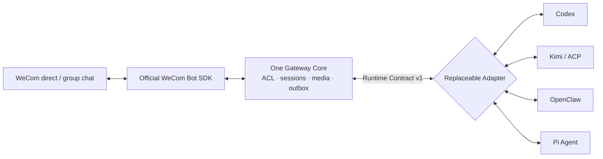
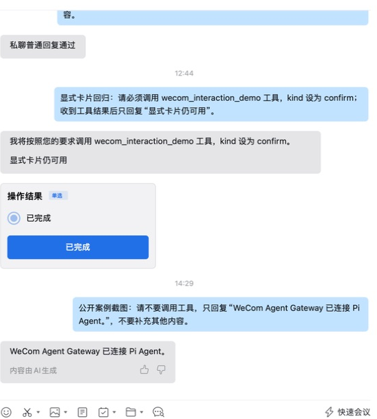

# Verified multi-kernel cases

This page separates real WeCom end-to-end evidence from local protocol smoke
tests and deterministic contracts. See [`status.md`](status.md) for the full
timeline and the [real WeCom runbook](real-wecom-runbook.md) for setup.



## Real-client snapshot

The complete 26-second client path—immediate status, final reply, confirmation,
same-task resume, and proactive text/image—is available as a
[`GIF`](assets/demo/wecom-agent-gateway-demo.gif) or
[`high-resolution MP4`](assets/demo/wecom-agent-gateway-demo.mp4). Raw desktop
captures never enter the repository.



Captured from a real macOS WeCom Bot conversation on 2026-08-28 and cropped to
exclude the conversation sidebar. The ordinary message is answered through the
Pi Adapter; the earlier card came from a separate explicit interaction request.
Ordinary replies do not attach a default card.

## Evidence matrix

| Kernel / Adapter | Real upstream                | Validated real WeCom scenarios                                            | Representative observation                                                      |
| ---------------- | ---------------------------- | ------------------------------------------------------------------------- | ------------------------------------------------------------------------------- |
| Codex            | App Server JSONL / SDK       | Direct/group, streaming, resume, image, dynamic tools, approval           | HTTP-only direct: ack 452ms, first text 3.88s, complete 5.12s                   |
| Kimi Code        | ACP v1 stdio                 | Direct text, same-session resume, image input                             | Text: ack 418ms, first text 5.68s, complete 6.42s; image complete 13.23s        |
| OpenClaw         | Gateway WebSocket v4         | Direct/group, resume, image/file/MP4                                      | Resumed direct turn: ack 446ms, first text 8.46s, complete 9.98s                |
| Pi Agent         | Official strict-LF JSONL RPC | Direct/group, resume, image, worker pool, ask-user, approval, cancel      | Two direct turns: ack 400/385ms, first text 3.919/2.638s, complete 4.610/3.382s |
| Generic ACP      | ACP v1 stdio                 | Real stdio initialize, capability negotiation, load/cancel/image contract | Kimi is the current real WeCom end-to-end implementation of this path           |

These measurements describe one dated local environment, not an SLA. Channel
acknowledgement and Kernel first-text latency are recorded separately so that
transport faults are not confused with model or Kernel reasoning time.

## What each case proves

- **Codex** exercises the richest bidirectional host protocol: persistent
  sessions, native ask-user, dynamic tools, approval, images, and cancellation.
  It is a reference Kernel, not a Gateway runtime dependency.
- **Kimi / ACP** proves that the same Core can host a non-Codex Kernel over a
  standard protocol. Input capabilities are negotiated and unsupported media
  fails closed.
- **OpenClaw** connects through its public Gateway client rather than embedding
  the WeCom Channel plugin. OpenClaw retains models, tools, and transcripts.
- **Pi Agent** uses the official JSONL RPC and validates a process Adapter,
  vision input, a bounded worker pool, and same-call native extension-UI resume.
  The screenshot above is real-client evidence for this path.

## Reproduce

These smoke commands contain no Bot or model credentials. Real WeCom runs use
the locally ignored configuration described in the runbook.

```bash
pnpm benchmark:codex-app-server
pnpm smoke:kimi-adapter
pnpm smoke:openclaw-adapter
pnpm smoke:pi-adapter
pnpm smoke:pi-image-adapter
pnpm run ci
```

## Evidence boundaries

- A screenshot proves only its labelled client scenario. Automated evidence in
  `status.md` covers protocol errors, restart, and fault recovery.
- Generic ACP has a real child-process protocol test; Kimi Code is its current
  real WeCom end-to-end implementation.
- Cards, office tools, and model vision are optional capabilities. Their absence
  must not break text, media, sessions, or reliable delivery.
- The repository never commits Bot secrets, model keys, internal conversation
  IDs, real contact data, or uncropped private chat captures.
