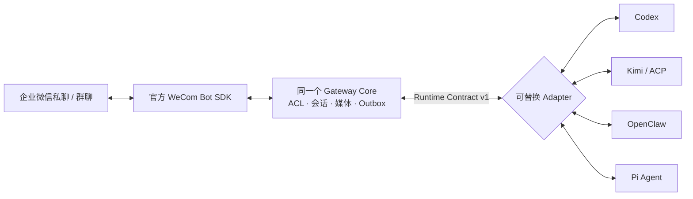

# 已验证的多 Kernel 接入案例

本页记录可复核的接入证据，不把 deterministic fake、仅本机协议 smoke 和真实企业微信端到端混为一谈。
完整逐项时间线见 [`status.md`](status.md)，部署步骤见
[`real-wecom-runbook.md`](real-wecom-runbook.md)。



## 真实客户端快照

26 秒真实客户端演示记录（即时状态、最终回复、确认卡片、原任务恢复、主动文本/图片）见
[`GIF 演示`](assets/demo/wecom-agent-gateway-demo.gif) 或
[`高清 MP4`](assets/demo/wecom-agent-gateway-demo.mp4)。原始桌面截图不进入仓库。


截图于 2026-08-28 取自 macOS 企业微信真实 Bot 私聊，并裁掉会话侧栏和无关内容。普通消息通过 Pi
Adapter 返回指定文本；上方卡片来自单独的显式交互请求。默认普通回复不会自动附卡，这正是卡片不
侵入 IM 主链路的验收条件。

## 历史证据矩阵

这些成功记录仍然有效，但只证明当时的接口、环境与场景；不是当前所有依赖版本重新认证。
Codex 的默认 App Server 与可选 SDK 是不同 Adapter 路径，不共享整套能力或验收结论。

| Kernel / Adapter | 上游接口                      | 历史已验证范围                                                                         | 代表性历史观测 / 日期                                                                                    |
| ---------------- | ----------------------------- | -------------------------------------------------------------------------------------- | -------------------------------------------------------------------------------------------------------- |
| Codex App Server | JSONL RPC；默认入口           | 真实企微私聊/群聊、流式、恢复、图片、动态工具与审批                                    | 2026-08-20 HTTP-only 私聊：回执 452ms，首文本 3.88s，完成 5.12s                                          |
| Codex SDK        | 官方 TypeScript SDK；可选入口 | 早期本机真实文本 smoke；流式快照与恢复 ID 有自动化测试，不承接上行的图片/工具/审批结论 | 原记录未单独标注该次 SDK 版本；不用于认证当前 SDK 0.153.2                                                |
| Kimi Code        | ACP v1 stdio                  | 真实企微私聊文本、同 session 恢复、图片输入                                            | 2026-08-24 文本：回执 418ms，首文本 5.68s，完成 6.42s；图片完成 13.23s                                   |
| OpenClaw         | Gateway WebSocket v4          | 真实企微私聊/群聊、多轮恢复、图片/文件/MP4                                             | 2026-08-24 私聊续接：回执 446ms，首文本 8.46s，完成 9.98s；2026-09-02 client beta.3 本机两轮另有通过记录 |
| Pi Agent         | 官方 LF JSONL RPC             | 真实企微私聊/群聊、恢复、图片、worker pool、ask-user、审批与取消                       | 2026-08-24 私聊两轮：回执 400/385ms，首文本 3.919/2.638s，完成 4.610/3.382s                              |
| 通用 ACP         | ACP v1 stdio                  | 真实子进程初始化、能力协商、load/cancel/image contract                                 | Kimi 是此路径的真实企微端到端代表；不外推其他 ACP harness                                                |

### 最近复测状态（截至 2026-09-07）

| Adapter / 版本                 | 最近结果                                                   | 证据与解释                                                                                            |
| ------------------------------ | ---------------------------------------------------------- | ----------------------------------------------------------------------------------------------------- |
| Codex App Server / CLI 0.145.0 | 2026-09-05 本机真实两轮与续接通过                          | [上手审计](onboarding-review.md)；不等于新 SDK 的验收                                                 |
| Codex SDK 0.153.2              | 2026-09-07 真实两轮检查 120 秒超时；成功路径未通过本次复测 | [依赖复核](reviews/runtime-clients-2026-09-07.md)；有界停止另通过，超时不证明默认 App Server 路径损坏 |
| Kimi Code 0.39.1 / ACP         | 2026-09-05 本机返回认证类失败                              | [上手审计](onboarding-review.md)；当前本机认证前置不足，不否定历史真实企微通过                        |
| OpenClaw client 2026.9.1       | 2026-09-07 本机 Gateway 不可用；新客户端真实通信未认证     | [依赖复核](reviews/runtime-clients-2026-09-07.md)；本机服务不可用不等于 Adapter 不兼容                |
| Pi / 本机既有配置              | 2026-09-07 新目录真实企微私聊、主动文本与重启续接通过      | [新目录实测](reviews/fresh-real-onboarding-2026-09-07.md)；复用已有账号，仅认证该次文本场景           |

Claude Code 仍是未注册到默认入口的实验包：SDK 0.3.260 的本机认证检查未登录，
真实成功 text/session/cancel 仍待验证，见[独立审查](reviews/claude-sdk-0.3.260.md)。

表中的 OpenClaw “MP4”只表示真实消息到达 Adapter 并得到能力相关回复，不表示模型已理解视频，也不能替代原生
`msgtype=video` callback 验收。所有媒体项都只对表中明确写出的 Kernel、方向和日期成立。

## 外部 Adapter 一致性证据

[`clean-room-adapter`](../examples/clean-room-adapter) 的运行时代码只依赖公共 Adapter SDK，不导入 Core、
Transport 或内置 Kernel。独立工具已验证文本、流式、session 恢复、引用、图片、reply-action 幂等和取消，
8 项通过、0 项失败、2 个未实现的可选 lifecycle 方法明确跳过。固定
[`JSON 报告`](evidence/adapter-conformance-clean-room.json) 由 CI 防漂移。

这是扩展契约证据，不是真实 Agent 或企业微信 E2E；第三方 Kernel 仍需独立 fake、真实 Kernel smoke 和
真实 WeCom 四层验收。

延迟是对应日期和本机环境的观测值，不是 SLA，也不能跨模型直接比较。Channel 回执与 Kernel 首文本
分层记录，用于区分企微链路问题和模型/Kernel 推理耗时。

## 各案例说明

- **Codex App Server** 的持久 session、动态工具审批和图片有真实企微记录。
  原生 `item/tool/requestUserInput`（ask-user）目前只有协议实现与自动化验证，不能写成真实客户端验收通过。
  **Codex SDK** 的本机文本 smoke 是另一项证据；不能用 App Server 测试替代 SDK 验收。
  Codex 只是参考 Kernel，不是 Gateway 的运行时依赖。
- **Kimi / ACP** 证明同一个 Core 可以通过标准 ACP 接入非 Codex Kernel；能力以 `initialize` 协商，
  不支持的模态 fail closed。
- **OpenClaw** 通过其公共 Gateway Client 接入，而不是嵌入企业微信 Channel 插件；OpenClaw 继续拥有
  模型、工具和 transcript。
- **Pi Agent** 使用官方 JSONL RPC，验证进程型 Adapter、视觉模型输入、有界 worker pool 以及原生
  extension UI 的同一调用恢复。上图是该路径的真实客户端证据。

## 可复现入口

以下 smoke 不包含 Bot 或模型凭据；真实企业微信步骤需要按联调手册准备本地忽略配置：

```bash
pnpm benchmark:codex-app-server
pnpm smoke:kimi-adapter
pnpm smoke:openclaw-adapter
pnpm smoke:pi-adapter
pnpm smoke:pi-image-adapter
pnpm run ci
```

## 证据边界

- 截图只证明其标注的真实客户端场景；协议错误、重启和故障恢复由自动化日志与 `status.md` 记录。
- Generic ACP 的协议契约已有真实子进程验证，当前企业微信端到端代表实现是 Kimi Code。
- 卡片、办公工具和模型视觉能力均为可选能力；任何一项缺失都不应破坏文本、媒体、会话和可靠投递。
- 仓库不提交 Bot Secret、模型密钥、内部会话 ID、真实通讯录或原始未裁剪聊天截图。
